# Workflow Diagrams Overview

This directory contains comprehensive flowchart diagrams for all orchestrator workflows in the Brooktec Claude Code Workflows marketplace.

## 📊 Diagram Types

### [Simplified Diagrams](./simplified/) (Recommended for Quick Overview)
High-level diagrams showing only phases and outcomes. Perfect for understanding the workflow at a glance.
- **Location**: [./simplified/](./simplified/)
- Fewer nodes and decision points
- Focus on main phases and user decisions
- Clear outcome visualization
- Quick reference

### Detailed Diagrams (Below)
Comprehensive step-by-step diagrams with all decision points, error handling, and agent invocations.
- Complete workflow logic
- All STOP conditions
- Retry mechanisms
- Agent specifications

---

## Available Diagrams

### 1. Frontend Feature Workflow
**File**: [frontend-feature-workflow.md](./frontend-feature-workflow.md)
**Command**: `/frontend-feature`
**Phases**: 4 (Setup, Development, Security, PR Creation)
**Key Features**:
- Technology detection (Angular/React/Mobile)
- Phase 2.5: Code Quality Review
- Approval checkpoint with 3 options
- Conditional PR creation with --skip-pr flag

### 2. Backend Feature Workflow
**File**: [backend-feature-workflow.md](./backend-feature-workflow.md)
**Command**: `/backend-feature`
**Phases**: 6 (Setup, Development, API Testing, Quality & Security, Approval, PR Creation)
**Key Features**:
- Technology detection (Express/NestJS)
- ORM/ODM detection and adaptation
- Conditional API testing with --skip-tests flag
- Security audit with OWASP Top 10
- Approval checkpoint with 3 options
- Conditional PR creation with --skip-pr flag

### 3. Pull Request Review Workflow
**File**: [review-pull-request-workflow.md](./review-pull-request-workflow.md)
**Command**: `/review-pull-request`
**Phases**: 6 (PR Info, Tech Detection, Code Quality, Security, Lint & Build, Summary)
**Key Features**:
- Comprehensive technology detection
- Code quality review with severity categorization
- Security audit with OWASP checks
- Automated lint and build verification
- Final recommendation: BLOCKED / REQUEST CHANGES / COMMENT / APPROVE

### 4. Create Pull Request Workflow
**File**: [create-pull-request-workflow.md](./create-pull-request-workflow.md)
**Command**: `/create-pull-request`
**Phases**: 4 (Prerequisites, Information, Content Generation, PR Creation)
**Key Features**:
- Git prerequisites validation
- Redmine taskId requirement
- Automated (gh CLI/MCP) or manual PR creation
- Comprehensive PR description generation
- Fallback to manual instructions if automation fails

### 5. Dependency Health Check Workflow
**File**: [check-dependencies-workflow.md](./check-dependencies-workflow.md)
**Command**: `/check-dependencies`
**Phases**: 5 (Node.js LTS, Security, Updates, Report, Verification)
**Key Features**:
- Node.js LTS validation and update
- Security vulnerability resolution
- Package updates (minor/patch only)
- 3 separate commits (one per phase)
- Automated verification (npm install, lint, build, test)
- Comprehensive markdown report

### 6. Backend Test Generation Workflow
**File**: [create-backend-tests-workflow.md](./create-backend-tests-workflow.md)
**Command**: `/create-backend-tests`
**Phases**: 8 (Setup, Analysis, Generation, Execution, Coverage, Quality, Approval, PR)
**Key Features**:
- Test type selection (unit/integration/e2e/all)
- Coverage threshold with automatic retry
- Test quality review
- Approval checkpoint with 3 options
- Conditional PR creation with --skip-pr flag
- Supports Jest, pytest, JUnit

## Diagram Legend

### Node Types

```mermaid
flowchart LR
    Start([Start/End Node])
    Process[Process Node]
    Decision{Decision Point}
    Stop[❌ STOP Node]
    Checkpoint[🛑 CHECKPOINT]
    Success([✅ Success])
    Warning[⚠️ Warning]
    Skip[⏭️ Skip]
    Critical[🔴 CRITICAL]

    classDef stopNode fill:#ff6b6b,stroke:#c92a2a,color:#fff
    classDef successNode fill:#51cf66,stroke:#2f9e44,color:#fff
    classDef processNode fill:#4dabf7,stroke:#1971c2,color:#fff
    classDef decisionNode fill:#ffd43b,stroke:#f59f00,color:#000
    classDef checkpointNode fill:#ff6b6b,stroke:#c92a2a,color:#fff,stroke-width:4px
    classDef warningNode fill:#ffa94d,stroke:#fd7e14,color:#000
    classDef criticalNode fill:#ff6b6b,stroke:#c92a2a,color:#fff,stroke-width:4px
    classDef skipNode fill:#868e96,stroke:#495057,color:#fff

    class Stop stopNode
    class Success successNode
    class Process processNode
    class Decision decisionNode
    class Checkpoint checkpointNode
    class Warning warningNode
    class Critical criticalNode
    class Skip skipNode
```



### Color Coding

- 🔴 **Red (STOP)**: Workflow stops, user action required
- 🟢 **Green (Success)**: Workflow completes successfully
- 🔵 **Blue (Process)**: Active processing step
- 🟡 **Yellow (Decision)**: Decision point or conditional branch
- 🟠 **Orange (Warning)**: Warning condition, workflow continues
- ⚫ **Gray (Skip)**: Step skipped due to flag or condition
- 🔴 **Red Bold (Critical)**: Critical failure requiring immediate attention

## Common Patterns

### STOP Conditions
All workflows include STOP conditions where user action is required:
- Missing prerequisites (CLAUDE.md, git branch, environment)
- Unclear requirements
- Ambiguous technology detection
- Failed validations
- Critical errors

### Approval Checkpoints
Several workflows include approval checkpoints where the workflow stops and presents findings for user review:
- **Frontend Feature**: After Phase 3 (Security Audit)
- **Backend Feature**: After Phase 4 (Quality & Security)
- **Backend Tests**: After Phase 7 (Quality Review)

User has 3 options:
1. **Approve and Create PR** → Continue to PR creation
2. **Approve without PR** → End workflow
3. **Request Changes** → Return to development phase

### Conditional Phases
Some workflows have conditional phases based on flags or user decisions:
- **--skip-pr flag**: Skip PR creation phase
- **--skip-tests flag**: Skip testing phase (backend-feature)
- User approval: Determines if PR phase executes

### Retry Logic
Workflows implement retry logic for recoverable failures:
- **Test execution**: Up to 3 retries
- **Coverage analysis**: Up to 2 attempts
- Automatic fixes attempted before user intervention

## Quick Reference

### Frontend Development
```bash
/frontend-feature Implement user authentication with JWT
```
→ See [frontend-feature-workflow.md](./frontend-feature-workflow.md)

### Backend Development
```bash
/backend-feature Implement authentication API with JWT
/backend-feature --skip-tests Implement utility functions
```
→ See [backend-feature-workflow.md](./backend-feature-workflow.md)

### Code Review
```bash
/review-pull-request 42
```
→ See [review-pull-request-workflow.md](./review-pull-request-workflow.md)

### Pull Request Creation
```bash
/create-pull-request Feature description
```
→ See [create-pull-request-workflow.md](./create-pull-request-workflow.md)

### Dependency Management
```bash
/check-dependencies
```
→ See [check-dependencies-workflow.md](./check-dependencies-workflow.md)

### Test Generation
```bash
/create-backend-tests --target src/services/user.service.ts
/create-backend-tests --target src/services/ --coverage-threshold 90
```
→ See [create-backend-tests-workflow.md](./create-backend-tests-workflow.md)

## How to Read the Diagrams

1. **Start at the top**: All workflows begin with a start node
2. **Follow the arrows**: Flow direction indicates execution order
3. **Decision diamonds**: Yellow diamonds indicate branching logic
4. **STOP signs**: Red boxes indicate workflow halts for user action
5. **Checkpoints**: Red outlined boxes with 🛑 indicate approval points
6. **End nodes**: Green rounded boxes indicate successful completion

## Rendering the Diagrams

These diagrams use Mermaid syntax and can be rendered in:
- **GitHub**: Native Mermaid support in markdown
- **VS Code**: Mermaid Preview extension
- **JetBrains IDEs**: Mermaid plugin
- **Online**: https://mermaid.live

## Contributing

When adding new orchestrators or modifying existing ones:
1. Create/update the diagram file in this directory
2. Follow the established color coding and node type conventions
3. Include comprehensive flow summary sections
4. Document all STOP conditions and decision points
5. Update this README.md with the new diagram reference

## Version History

- **v0.0.7**: Added backend-feature and created all 6 workflow diagrams
- **v0.0.6**: Frontend feature standardization
- **v0.0.5**: Added test orchestration workflow

---

**Last Updated**: 2025-11-05
**Marketplace Version**: v0.0.7
