# Backend Feature Workflow Diagram

## Command: `/backend-feature`

```mermaid
flowchart TD
    Start([Start: /backend-feature]) --> ParseFlags{Parse Flags}
    ParseFlags --> CheckFlags[Check --skip-pr and --skip-tests]
    CheckFlags --> Phase1["Phase 1: Setup & Requirements<br/><i>project-setup, requirements-reviewer</i>"]

    %% Phase 1
    Phase1 --> Step1_1[Step 1: Project Setup Agent]
    Step1_1 --> CheckClaude{CLAUDE.md exists?}
    CheckClaude -->|No| Stop1[❌ STOP: Run /init]
    CheckClaude -->|Yes| CheckBranch{Git branch valid?}
    CheckBranch -->|No| Stop2[❌ STOP: Create feature branch]
    CheckBranch -->|Yes| CheckCommits{Uncommitted changes?}
    CheckCommits -->|Yes| Stop3[❌ STOP: Commit or stash]
    CheckCommits -->|No| CheckEnv{Environment valid?}
    CheckEnv -->|No| Stop4[❌ STOP: Fix environment]
    CheckEnv -->|Yes| Step1_2[Step 2: Requirements Reviewer]

    Step1_2 --> ReqClear{Backend requirements clear?}
    ReqClear -->|No| Stop5[❌ STOP: Clarify API specs, business logic]
    ReqClear -->|Yes| Phase2["Phase 2: Development<br/><i>technology-detector, node-developer</i>"]

    %% Phase 2
    Phase2 --> Step2_1[Step 1: Technology Detector]
    Step2_1 --> TechClear{Framework detected?}
    TechClear -->|Ambiguous| Stop6[❌ STOP: Specify Express/NestJS]
    TechClear -->|Express| UseExpress[Use node-developer with Express patterns]
    TechClear -->|NestJS| UseNest[Use node-developer with NestJS patterns]

    UseExpress --> DetectORM[Detect ORM/ODM, Validation, Auth]
    UseNest --> DetectORM

    DetectORM --> Implement[Step 2: Implement Backend Feature]
    Implement --> ImplDetails[API endpoints, validation, business logic, DB entities, auth, error handling, logging]
    ImplDetails --> CheckSkipTests{--skip-tests flag?}

    %% Phase 3 (Conditional)
    CheckSkipTests -->|No| Phase3["Phase 3: API Testing<br/><i>test-generator</i>"]
    CheckSkipTests -->|Yes| SkipTests[⏭️ Skip API Testing]
    SkipTests --> Phase4

    Phase3 --> Step3_1[Step 1: Generate API Tests]
    Step3_1 --> TestGen[test-generator: Integration tests with Supertest]
    TestGen --> Step3_2[Step 2: Execute Tests]
    Step3_2 --> TestsPass{All tests passing?}
    TestsPass -->|No| RetryTests{Retry count < 3?}
    RetryTests -->|Yes| FixTests[Analyze and fix tests/implementation]
    FixTests --> Step3_2
    RetryTests -->|No| Stop7[❌ STOP: Manual intervention needed]
    TestsPass -->|Yes| Phase4["Phase 4: Quality & Security Review<br/><i>code-reviewer, security-auditor</i>"]

    %% Phase 4
    Phase4 --> Step4_1[Step 1: Code Quality Review]
    Step4_1 --> CodeReview[code-reviewer: Structure, types, DB queries, API design]
    CodeReview --> Step4_2[Step 2: Security Audit]
    Step4_2 --> SecurityAudit[security-auditor: Input validation, injection prevention, auth security, OWASP Top 10]
    SecurityAudit --> ApprovalPoint[🛑 APPROVAL CHECKPOINT]

    %% Approval Checkpoint
    ApprovalPoint --> PresentFindings[Present: Implementation + Tests + Quality + Security]
    PresentFindings --> UserDecision{User Decision?}

    UserDecision -->|Request Changes| ReturnPhase2[Return to Phase 2]
    ReturnPhase2 --> Step2_1

    UserDecision -->|Approve without PR| EndNoRP([✅ End: No PR created])

    UserDecision -->|Approve and Create PR| CheckSkipPRFlag{--skip-pr flag set?}
    CheckSkipPRFlag -->|Yes| EndNoRP
    CheckSkipPRFlag -->|No| Phase6["Phase 6: PR Creation<br/><i>pull-request-manager</i>"]

    %% Phase 6
    Phase6 --> GetTaskId[Request Redmine taskId]
    GetTaskId --> ValidateCommits{All changes committed?}
    ValidateCommits -->|No| Stop8[❌ STOP: Commit changes]
    ValidateCommits -->|Yes| GeneratePR[Generate PR Content with API endpoints, quality, security]
    GeneratePR --> CreatePR[Create Pull Request]
    CreatePR --> EndWithPR([✅ End: PR Created])

    %% Styling
    classDef stopNode fill:#ff6b6b,stroke:#c92a2a,color:#fff
    classDef successNode fill:#51cf66,stroke:#2f9e44,color:#fff
    classDef processNode fill:#4dabf7,stroke:#1971c2,color:#fff
    classDef decisionNode fill:#ffd43b,stroke:#f59f00,color:#000
    classDef checkpointNode fill:#ff6b6b,stroke:#c92a2a,color:#fff,stroke-width:4px
    classDef skipNode fill:#868e96,stroke:#495057,color:#fff

    class Stop1,Stop2,Stop3,Stop4,Stop5,Stop6,Stop7,Stop8 stopNode
    class EndNoRP,EndWithPR successNode
    class Phase1,Phase2,Phase3,Phase4,Phase6,Step1_1,Step1_2,Step2_1,Implement,ImplDetails,TestGen,CodeReview,SecurityAudit,GeneratePR,CreatePR processNode
    class CheckClaude,CheckBranch,CheckCommits,CheckEnv,ReqClear,TechClear,CheckSkipTests,TestsPass,RetryTests,UserDecision,CheckSkipPRFlag,ValidateCommits decisionNode
    class ApprovalPoint checkpointNode
    class SkipTests skipNode
```

## Flow Summary

### Phase 1: Setup & Requirements Validation
- **Inputs**: Feature description, flags (--skip-pr, --skip-tests)
- **Agents**: project-setup, requirements-reviewer
- **Stop Conditions**:
  - CLAUDE.md missing → User must run /init
  - Wrong git branch → User must create feature branch
  - Uncommitted changes → User must commit/stash
  - Environment issues → User must fix
  - Unclear backend requirements → User must clarify API specs, business logic, validation rules
- **Output**: Validated environment, clear backend requirements

### Phase 2: Development
- **Inputs**: Validated requirements
- **Agents**: technology-detector, node-developer
- **Stop Conditions**:
  - Ambiguous framework → User must specify Express or NestJS
- **Detection**:
  - Backend framework: Express.js or NestJS
  - ORM/ODM: TypeORM, Prisma, Mongoose, Sequelize
  - Validation: Joi, class-validator, Zod, yup
  - Authentication: JWT, Passport.js, session-based
- **Implementation**:
  - RESTful API endpoints with proper HTTP methods
  - Request validation at API boundaries
  - Business logic in service layer
  - Database entities with migrations
  - Authentication/authorization
  - Error handling and logging
  - Security best practices
- **Output**: Implemented backend feature with all components

### Phase 3: API Testing & Validation (Conditional)
- **Condition**: --skip-tests flag NOT set
- **Inputs**: Implemented API endpoints
- **Agents**: test-generator
- **Steps**:
  1. Generate API integration tests (happy paths, edge cases, errors)
  2. Execute tests with Supertest
  3. Retry up to 3 times on failure
- **Stop Conditions**:
  - Tests fail after 3 retries → Manual intervention needed
- **Skip**: If --skip-tests flag set (for utilities with no API endpoints)
- **Output**: All API tests passing

### Phase 4: Quality & Security Review
- **Inputs**: Implemented code, test results (if Phase 3 ran)
- **Agents**: code-reviewer, security-auditor
- **Reviews**:
  - **Code Quality**: Structure, TypeScript types, error handling, DB queries, API design, maintainability
  - **Security**: Input validation, injection prevention, auth security, OWASP Top 10
- **Output**: Quality assessment + Security assessment with findings

### Approval Checkpoint
- **Inputs**: Implementation + Tests + Quality + Security findings
- **User Options**:
  1. **Request Changes** → Return to Phase 2
  2. **Approve without PR** → End workflow
  3. **Approve and Create PR** → Continue to Phase 6 (if --skip-pr not set)

### Phase 6: Pull Request Creation (Conditional)
- **Condition**: User approved with PR AND --skip-pr not set
- **Inputs**: All previous findings
- **Command**: create-pull-request
- **Stop Conditions**:
  - Uncommitted changes → User must commit
- **Output**: PR created with API endpoints, quality, security results

## Flags

- `--skip-pr`: Skip Phase 6 entirely, end after approval
- `--skip-tests`: Skip Phase 3 entirely (for utilities without API endpoints)

## Technology Support

### Supported Frameworks
- Express.js
- NestJS

### Supported ORMs/ODMs
- TypeORM (PostgreSQL, MySQL)
- Prisma (PostgreSQL, MySQL, MongoDB)
- Mongoose (MongoDB)
- Sequelize (PostgreSQL, MySQL)

### Supported Validation Libraries
- Joi
- class-validator (NestJS)
- Zod
- yup

### Supported Authentication
- JWT tokens
- Passport.js
- Session-based
