# Dependency Health Check Workflow Diagram

## Command: `/check-dependencies`

```mermaid
flowchart TD
    Start([Start: /check-dependencies]) --> Phase1[Phase 1: Node.js LTS Version Validation]

    %% Phase 1
    Phase1 --> Step1_1[dependency-health-checker: Validate Node.js version]
    Step1_1 --> CheckNode{Node.js installed?}
    CheckNode -->|No| Stop1[❌ STOP: Install Node.js LTS]
    CheckNode -->|Yes| GetNodeVersion[Run: node --version]
    GetNodeVersion --> CheckNvmrc{.nvmrc exists?}
    CheckNvmrc -->|No| CreateNvmrc[Create .nvmrc with LTS version]
    CheckNvmrc -->|Yes| ReadNvmrc[Read .nvmrc version]
    CreateNvmrc --> RunNpuc
    ReadNvmrc --> RunNpuc[Run: npx npuc --init]

    RunNpuc --> NpucSuccess{npuc succeeded?}
    NpucSuccess -->|No| Stop2[❌ STOP: Network or npm issue]
    NpucSuccess -->|Yes| CompareLTS{Current version is LTS?}
    CompareLTS -->|No| UpdateNvmrc[Update .nvmrc to LTS version]
    CompareLTS -->|Yes| NoChangeNeeded[Document: No change needed]
    UpdateNvmrc --> Commit1
    NoChangeNeeded --> Commit1[Create commit: chore validate and update Node.js to LTS version]

    Commit1 --> VerifyCommit1{Commit created?}
    VerifyCommit1 -->|No| Stop3[❌ STOP: Git error]
    VerifyCommit1 -->|Yes| Phase2[Phase 2: Security Vulnerability Resolution]

    %% Phase 2
    Phase2 --> Step2_1[dependency-health-checker: Audit and resolve vulnerabilities]
    Step2_1 --> RunAudit[Run: npm audit --json]
    RunAudit --> AuditSuccess{Audit succeeded?}
    AuditSuccess -->|No| Stop4[❌ STOP: npm registry unavailable]
    AuditSuccess -->|Yes| ParseVulns[Parse vulnerabilities by severity: critical, high, moderate, low]

    ParseVulns --> CheckDeprecated[Check for deprecation warnings]
    CheckDeprecated --> FoundDeprecated{Deprecated packages?}
    FoundDeprecated -->|Yes| AskMigrate[❓ STOP: Ask user about migration]
    AskMigrate --> UserMigrate{User wants to migrate?}
    UserMigrate -->|Yes| GuideMigration[Guide migration process]
    UserMigrate -->|No| MarkDeprecated[Mark with ❌ in report, continue]
    FoundDeprecated -->|No| FixVulns
    GuideMigration --> FixVulns
    MarkDeprecated --> FixVulns[Run: npm audit fix]

    FixVulns --> CheckBreaking{Breaking changes required?}
    CheckBreaking -->|Yes| Stop5[❌ STOP: Ask user for approval]
    CheckBreaking -->|No| ApplyFixes[Apply vulnerability fixes]
    ApplyFixes --> ReAudit[Re-run: npm audit]
    ReAudit --> CountFixed[Count vulnerabilities resolved]
    CountFixed --> Commit2[Create commit: chore resolve security vulnerabilities in dependencies]

    Commit2 --> VerifyCommit2{Commit created?}
    VerifyCommit2 -->|No| Stop6[❌ STOP: Git error]
    VerifyCommit2 -->|Yes| Phase3[Phase 3: Package Updates Minor/Patch]

    %% Phase 3
    Phase3 --> Step3_1[dependency-health-checker: Update packages]
    Step3_1 --> RunOutdated[Run: npm outdated --json]
    RunOutdated --> FilterUpdates[Filter: Minor and patch updates only]
    FilterUpdates --> CheckMajor{Major updates available?}
    CheckMajor -->|Yes| MarkBlocked[Mark with ⚠️ blocked by breaking changes]
    CheckMajor -->|No| ApplyUpdates
    MarkBlocked --> ApplyUpdates[Apply minor/patch updates]

    ApplyUpdates --> UpdateConflicts{Dependency conflicts?}
    UpdateConflicts -->|Yes| Stop7[❌ STOP: Resolve conflicts]
    UpdateConflicts -->|No| VerifyTree[Run: npm ls to verify dependency tree]
    VerifyTree --> TreeBroken{Dependency tree broken?}
    TreeBroken -->|Yes| Stop8[❌ STOP: Rollback Phase 3 commit]
    TreeBroken -->|No| Commit3[Create commit: chore update dependencies to latest minor/patch versions]

    Commit3 --> VerifyCommit3{Commit created?}
    VerifyCommit3 -->|No| Stop9[❌ STOP: Git error]
    VerifyCommit3 -->|Yes| Phase4[Phase 4: Report Generation]

    %% Phase 4
    Phase4 --> Step4_1[dependency-health-checker: Generate report]
    Step4_1 --> CompileData[Compile results from Phases 1-3]
    CompileData --> CreateReport[Create dependency-health-report.md]
    CreateReport --> ReportSections[Sections: Summary, Phase 1, Phase 2, Phase 3, Recommendations, Git Commits]
    ReportSections --> AddTables[Add tables with status indicators ✅/❌/⚠️]
    AddTables --> AddRecommendations[Add immediate actions and future maintenance]
    AddRecommendations --> WriteFile[Write report to project root]
    WriteFile --> DisplaySummary[Display condensed summary to user]
    DisplaySummary --> Phase5[Phase 5: Automated Verification]

    %% Phase 5
    Phase5 --> Step5_1[dependency-health-checker: Verify changes]
    Step5_1 --> CleanInstall[Remove node_modules and package-lock.json]
    CleanInstall --> FreshInstall[Run: npm install from clean state]
    FreshInstall --> InstallSuccess{npm install succeeded?}
    InstallSuccess -->|No| StopCritical1[🔴 CRITICAL: Rollback commits?]
    InstallSuccess -->|Yes| CheckLintScript{npm run lint script exists?}

    CheckLintScript -->|No| SkipLint[Skip lint, note in report]
    CheckLintScript -->|Yes| RunLint[Run: npm run lint]
    RunLint --> LintPassed{Lint passed?}
    LintPassed -->|Failed| RecordLint[Document lint errors, continue]
    LintPassed -->|Passed| CheckBuildScript
    SkipLint --> CheckBuildScript
    RecordLint --> CheckBuildScript{npm run build script exists?}

    CheckBuildScript -->|No| SkipBuild[Skip build, note in report]
    CheckBuildScript -->|Yes| RunBuild[Run: npm run build]
    RunBuild --> BuildPassed{Build passed?}
    BuildPassed -->|Failed| StopCritical2[🔴 CRITICAL: Rollback commits?]
    BuildPassed -->|Passed| CheckTestScript
    SkipBuild --> CheckTestScript
    CheckTestScript{npm test script exists?}

    CheckTestScript -->|No| SkipTest[Skip test, note in report]
    CheckTestScript -->|Yes| RunTest[Run: npm test]
    RunTest --> TestPassed{Tests passed?}
    TestPassed -->|Failed| CompareTests[Compare with previous test results]
    CompareTests --> NewFailures{New failures introduced?}
    NewFailures -->|Yes| StopCritical3[🔴 CRITICAL: Rollback commits?]
    NewFailures -->|No| RecordTests[Document test failures, continue]
    TestPassed -->|Passed| UpdateReport
    SkipTest --> UpdateReport
    RecordTests --> UpdateReport[Update report with Phase 5 verification results]

    UpdateReport --> FinalValidation[Verify all 3 commits exist in git log]
    FinalValidation --> CheckReportFile{Report file created?}
    CheckReportFile -->|No| Stop10[❌ STOP: Report generation failed]
    CheckReportFile -->|Yes| CheckGitClean{Git status clean except report?}
    CheckGitClean -->|No| Warn2[⚠️ WARNING: Unexpected uncommitted changes]
    CheckGitClean -->|Yes| FinalStatus
    Warn2 --> FinalStatus[Determine final status: PASSED / PASSED WITH WARNINGS / FAILED]

    FinalStatus --> End([✅ End: Report generated at dependency-health-report.md])

    %% Styling
    classDef stopNode fill:#ff6b6b,stroke:#c92a2a,color:#fff
    classDef criticalNode fill:#ff6b6b,stroke:#c92a2a,color:#fff,stroke-width:4px
    classDef successNode fill:#51cf66,stroke:#2f9e44,color:#fff
    classDef processNode fill:#4dabf7,stroke:#1971c2,color:#fff
    classDef decisionNode fill:#ffd43b,stroke:#f59f00,color:#000
    classDef warningNode fill:#ffa94d,stroke:#fd7e14,color:#000
    classDef skipNode fill:#868e96,stroke:#495057,color:#fff

    class Stop1,Stop2,Stop3,Stop4,Stop5,Stop6,Stop7,Stop8,Stop9,Stop10 stopNode
    class StopCritical1,StopCritical2,StopCritical3 criticalNode
    class End successNode
    class Phase1,Phase2,Phase3,Phase4,Phase5,Step1_1,Step2_1,Step3_1,Step4_1,Step5_1 processNode
    class CheckNode,NpucSuccess,CompareLTS,VerifyCommit1,AuditSuccess,FoundDeprecated,UserMigrate,CheckBreaking,VerifyCommit2,CheckMajor,UpdateConflicts,TreeBroken,VerifyCommit3,InstallSuccess,CheckLintScript,LintPassed,CheckBuildScript,BuildPassed,CheckTestScript,TestPassed,NewFailures,CheckReportFile,CheckGitClean decisionNode
    class Warn2,MarkBlocked,MarkDeprecated warningNode
    class SkipLint,SkipBuild,SkipTest skipNode
```



## Flow Summary

### Phase 1: Node.js LTS Version Validation
- **Inputs**: Current Node.js installation
- **Agent**: dependency-health-checker
- **Steps**:
  1. Check Node.js installed
  2. Get current version
  3. Check/create .nvmrc file
  4. Run npx npuc --init to get LTS recommendation
  5. Update .nvmrc if needed
  6. Create commit
- **Stop Conditions**:
  - Node.js not installed → User must install
  - npx/npm errors → Network or npm issue
  - Git errors → Cannot commit
- **Commit**: `chore: validate and update Node.js to LTS version`
- **Output**: Node.js on LTS version, commit created

### Phase 2: Security Vulnerability Resolution
- **Inputs**: Current dependencies
- **Agent**: dependency-health-checker
- **Steps**:
  1. Run npm audit to identify vulnerabilities
  2. Check for deprecated packages
  3. If deprecated: STOP and ask user about migration
  4. Run npm audit fix (avoid breaking changes)
  5. Re-audit to verify fixes
  6. Create commit
- **Stop Conditions**:
  - npm registry unavailable → Cannot proceed
  - Deprecated packages → User decision needed
  - Breaking changes required → User approval needed
  - Git errors → Cannot commit
- **User Interactions**:
  - Deprecated package found: "Migrate to [alternative]? (yes/no)"
  - Breaking change required: "Apply major update? (yes/no)"
- **Commit**: `chore: resolve security vulnerabilities in dependencies`
- **Output**: Vulnerabilities resolved, deprecated packages marked (❌), commit created

### Phase 3: Package Updates (Minor/Patch)
- **Inputs**: Current package versions
- **Agent**: dependency-health-checker
- **Steps**:
  1. Run npm outdated to find available updates
  2. Filter to minor/patch updates only
  3. Mark major updates as blocked (⚠️)
  4. Apply safe updates
  5. Verify dependency tree
  6. Create commit
- **Stop Conditions**:
  - Dependency conflicts → User must resolve
  - Broken dependency tree → Rollback Phase 3
  - Git errors → Cannot commit
- **Blocked**: Major updates documented with migration guides
- **Commit**: `chore: update dependencies to latest minor/patch versions`
- **Output**: Packages updated, major updates blocked (⚠️), commit created

### Phase 4: Report Generation
- **Inputs**: Results from Phases 1-3
- **Agent**: dependency-health-checker
- **Steps**:
  1. Compile all data from previous phases
  2. Create markdown report structure
  3. Add summary table
  4. Add phase-specific tables (Node.js, vulnerabilities, updates)
  5. Add status indicators (✅/❌/⚠️)
  6. Add recommendations section
  7. List git commits created
  8. Write to dependency-health-report.md
  9. Display condensed summary
- **Report Sections**:
  - Summary (phase status, changes count)
  - Phase 1: Node.js Version Validation
  - Phase 2: Security Vulnerabilities (resolved, deprecated, blocked)
  - Phase 3: Package Updates (updated, blocked by breaking changes)
  - Phase 4: Verification (to be filled in Phase 5)
  - Recommendations (immediate actions, future maintenance)
  - Git Commits Created
- **Output**: Comprehensive report file with all changes documented

### Phase 5: Automated Verification
- **Inputs**: Updated dependencies
- **Agent**: dependency-health-checker
- **Steps**:
  1. Remove node_modules and package-lock.json
  2. Run npm install from clean state
  3. Run npm run lint (if script exists)
  4. Run npm run build (if script exists)
  5. Run npm test (if script exists)
  6. Update report with verification results
  7. Validate all commits exist
  8. Check git status
- **Stop Conditions** (CRITICAL):
  - npm install fails → Rollback commits?
  - Build fails → Rollback commits?
  - New test failures introduced → Rollback commits?
- **Non-Critical**:
  - Lint errors → Document but continue
  - Pre-existing test failures → Document but continue
  - Scripts missing → Skip and note in report
- **Final Status**:
  - **PASSED**: All checks successful
  - **PASSED WITH WARNINGS**: Non-critical issues (lint errors, skipped checks)
  - **FAILED**: Critical failures (install, build, new test failures)
- **Output**: Updated report with verification results, final status

## Commit Strategy

Three separate commits are created (one per change phase):

1. **Phase 1 Commit**: `chore: validate and update Node.js to LTS version`
   - Changes: .nvmrc
   - Body: Node version before/after, LTS status

2. **Phase 2 Commit**: `chore: resolve security vulnerabilities in dependencies`
   - Changes: package.json, package-lock.json
   - Body: Vulnerability count, CVE IDs resolved

3. **Phase 3 Commit**: `chore: update dependencies to latest minor/patch versions`
   - Changes: package.json, package-lock.json
   - Body: Package count, version changes

**Why separate commits?**
- Easy to rollback individual phases if issues arise
- Clear audit trail of what changed in each phase
- Allows bisecting to identify which phase caused issues

## Report Example

```markdown
# Dependency Health Check Report

**Generated**: 2025-11-05 14:30:00
**Project**: my-project
**Working Directory**: /Users/user/projects/my-project

---

## Summary

| Phase | Status | Changes |
|-------|--------|---------|
| Node.js LTS Validation | ✅ | v18.x → v20.x |
| Security Vulnerabilities | ✅ | 5 vulnerabilities resolved |
| Package Updates | ⚠️ | 12 packages updated, 2 blocked |
| Verification | ✅ | All checks passed |

---

## Phase 1: Node.js Version Validation

| Item | Before | After | Status |
|------|--------|-------|--------|
| Node.js Version | 18.17.1 | 20.10.0 | ✅ |
| .nvmrc | 18 | 20 | ✅ |
| LTS Status | Yes | Yes | ✅ |

**Commit**: abc123 - chore: validate and update Node.js to LTS version

---

## Phase 2: Security Vulnerabilities

### Vulnerabilities Resolved

| CVE | Package | Severity | Version Before | Version After | Status |
|-----|---------|----------|----------------|---------------|--------|
| CVE-2023-12345 | lodash | critical | 4.17.15 | 4.17.21 | ✅ |

### Deprecated Packages

| Package | Current Version | Alternative | Status |
|---------|----------------|-------------|--------|
| request | 2.88.2 | axios | ❌ |

**Commit**: def456 - chore: resolve security vulnerabilities in dependencies

---

## Phase 3: Package Updates

### Packages Updated

| Package | Version Before | Version After | Update Type | Status |
|---------|----------------|---------------|-------------|--------|
| express | 4.17.1 | 4.18.2 | minor | ✅ |

### Updates Blocked (Breaking Changes)

| Package | Current | Available | Reason | Migration Guide | Status |
|---------|---------|-----------|--------|-----------------|--------|
| webpack | 5.75.0 | 6.0.0 | Breaking changes | https://... | ⚠️ |

**Commit**: ghi789 - chore: update dependencies to latest minor/patch versions

---

## Phase 4: Verification

| Check | Command | Result | Status |
|-------|---------|--------|--------|
| Dependencies Install | npm install | Success | ✅ |
| Linting | npm run lint | Passed | ✅ |
| Build | npm run build | Passed | ✅ |
| Tests | npm test | 45 passed | ✅ |

---

## Recommendations

### Immediate Actions Required
- Migrate from 'request' to 'axios' (deprecated package)

### Future Maintenance
- Schedule weekly dependency checks
- Monitor webpack for v6 migration guide updates

### Blocked Items Summary
- 1 deprecated package needs migration
- 2 major updates available but blocked

---

## Git Commits Created

1. abc123 - chore: validate and update Node.js to LTS version
2. def456 - chore: resolve security vulnerabilities in dependencies
3. ghi789 - chore: update dependencies to latest minor/patch versions
```

## Status Indicators

- ✅ **Success**: Task completed successfully
- ❌ **Deprecated/Failed**: Package deprecated or task failed
- ⚠️ **Blocked/Warning**: Update blocked by breaking changes or warning condition
