# Backend Test Generation Workflow Diagram

## Command: `/create-backend-tests`

```mermaid
flowchart TD
    Start([Start: /create-backend-tests]) --> ParseFlags{Parse Flags}
    ParseFlags --> CheckFlags[Check --target, --type, --coverage-threshold, --skip-pr]
    CheckFlags --> ValidateTarget{--target provided?}
    ValidateTarget -->|No| Stop1[❌ STOP: --target required]
    ValidateTarget -->|Yes| Phase1[Phase 1: Setup & Requirements]

    %% Phase 1
    Phase1 --> Step1_1[requirements-reviewer: Validate test generation requirements]
    Step1_1 --> ReqClear{Requirements clear?}
    ReqClear -->|No| Stop2[❌ STOP: Request clarification]
    ReqClear -->|Yes| Step1_2[project-setup: Verify environment]
    Step1_2 --> EnvValid{Environment ready?}
    EnvValid -->|No| Stop3[❌ STOP: Fix environment]
    EnvValid -->|Yes| DetectFramework[Detect test framework: Jest, pytest, JUnit]
    DetectFramework --> FrameworkFound{Framework detected?}
    FrameworkFound -->|No| Stop4[❌ STOP: Install test dependencies]
    FrameworkFound -->|Yes| IdentifyTargets[Identify target files from --target flag]
    IdentifyTargets --> TargetsExist{Targets exist?}
    TargetsExist -->|No| Stop5[❌ STOP: Target not found]
    TargetsExist -->|Yes| CheckExisting[Check if tests already exist]
    CheckExisting --> Phase2[Phase 2: Code Analysis & Test Planning]

    %% Phase 2
    Phase2 --> Step2_1[technology-detector: Detect backend framework]
    Step2_1 --> BackendDetected{Framework detected?}
    BackendDetected -->|Ambiguous| Stop6[❌ STOP: Specify framework]
    BackendDetected -->|Express| UseExpress[Node.js + Express patterns]
    BackendDetected -->|NestJS| UseNest[Node.js + NestJS patterns]
    BackendDetected -->|Python| UsePython[Python + pytest patterns]
    BackendDetected -->|Java| UseJava[Java + JUnit patterns]

    UseExpress --> Step2_2
    UseNest --> Step2_2
    UsePython --> Step2_2
    UseJava --> Step2_2[test-generator: Analyze target code]

    Step2_2 --> ReadTargets[Read and analyze each target file]
    ReadTargets --> IdentifyUnits[Identify functions/methods/classes to test]
    IdentifyUnits --> IdentifyDeps[Identify dependencies: DBs, APIs, services]
    IdentifyDeps --> PlanScenarios[Identify test scenarios: happy paths, edge cases, errors]
    PlanScenarios --> PlanMocking[Plan mocking strategy for external dependencies]
    PlanMocking --> EstimateTests[Estimate test count and complexity]
    EstimateTests --> Phase3[Phase 3: Test Generation]

    %% Phase 3
    Phase3 --> Step3_1[test-generator: Generate test suite]
    Step3_1 --> GenTests[Generate tests for all identified scenarios]
    GenTests --> UseFrameworkSyntax[Use detected framework syntax: Jest/pytest/JUnit]
    UseFrameworkSyntax --> ApplyAAA[Follow AAA pattern: Arrange, Act, Assert]
    ApplyAAA --> MockDeps[Mock all external dependencies properly]
    MockDeps --> NamingDesc[Use descriptive test names]
    NamingDesc --> AddComments[Add comments for complex scenarios]
    AddComments --> EnsureIndependence[Ensure test independence: no shared state]
    EnsureIndependence --> CoverBranches[Cover all code branches]
    CoverBranches --> WriteFiles[Write test files to proper directories]
    WriteFiles --> Phase4[Phase 4: Test Execution & Validation]

    %% Phase 4
    Phase4 --> Step4_1[Execute generated tests]
    Step4_1 --> RunTests[Run: npm test / pytest / mvn test]
    RunTests --> TestsPass{All tests passing?}
    TestsPass -->|No| RetryCount{Retry < 3?}
    RetryCount -->|Yes| AnalyzeFailure[Analyze failure: test issue or code bug?]
    AnalyzeFailure --> FixType{Issue in?}
    FixType -->|Test| FixTest[Fix generated tests]
    FixType -->|Code| ReportBug[Report code bug to user]
    FixTest --> RunTests
    ReportBug --> RunTests
    RetryCount -->|No| Stop7[❌ STOP: Manual intervention needed]
    TestsPass -->|Yes| Phase5[Phase 5: Coverage Analysis]

    %% Phase 5
    Phase5 --> Step5_1[Run coverage report]
    Step5_1 --> RunCoverage[Run: npm run test:coverage / pytest --cov]
    RunCoverage --> ParseCoverage[Parse coverage metrics: line, branch, function]
    ParseCoverage --> CompareThreshold{Coverage >= threshold?}
    CompareThreshold -->|No| AttemptCount{Attempt < 2?}
    AttemptCount -->|Yes| IdentifyGaps[Identify uncovered lines/branches]
    IdentifyGaps --> GenAdditional[Generate additional tests for gaps]
    GenAdditional --> RunCoverage
    AttemptCount -->|No| AskUser[Ask user if acceptable to proceed]
    AskUser --> UserAccepts{User accepts?}
    UserAccepts -->|No| Stop8[❌ STOP: Generate more tests]
    UserAccepts -->|Yes| Phase6
    CompareThreshold -->|Yes| Phase6[Phase 6: Test Quality Review]

    %% Phase 6
    Phase6 --> Step6_1[code-reviewer: Review test code quality]
    Step6_1 --> ReviewStructure[Review: Test structure, organization]
    ReviewStructure --> ReviewFramework[Review: Proper use of testing framework]
    ReviewFramework --> ReviewMocks[Review: Mock quality and appropriateness]
    ReviewMocks --> ReviewIndependence[Review: Test independence]
    ReviewIndependence --> ReviewAssertions[Review: Assertion quality]
    ReviewAssertions --> ReviewNaming[Review: Test naming conventions]
    ReviewNaming --> ReviewAAA[Review: AAA pattern adherence]
    ReviewAAA --> ReviewMaint[Review: Test maintainability]
    ReviewMaint --> ReviewFlaky[Check: Absence of flaky patterns]
    ReviewFlaky --> Phase7[Phase 7: Approval Checkpoint]

    %% Phase 7
    Phase7 --> PresentSummary[Present: Tests generated, execution results, coverage, quality]
    PresentSummary --> UserDecision{User Decision?}

    UserDecision -->|Request Changes| ReturnPhase3[Return to Phase 3 with feedback]
    ReturnPhase3 --> Step3_1

    UserDecision -->|Approve without PR| EndNoRP([✅ End: Tests generated, no PR])

    UserDecision -->|Approve and Create PR| CheckSkipPRFlag{--skip-pr flag set?}
    CheckSkipPRFlag -->|Yes| EndNoRP
    CheckSkipPRFlag -->|No| Phase8[Phase 8: PR Creation]

    %% Phase 8
    Phase8 --> GetTaskId[Request Redmine taskId]
    GetTaskId --> CreatePR[create-pull-request command]
    CreatePR --> PRContent[PR with: tests generated, coverage, quality assessment]
    PRContent --> EndWithPR([✅ End: PR Created])

    %% Styling
    classDef stopNode fill:#ff6b6b,stroke:#c92a2a,color:#fff
    classDef successNode fill:#51cf66,stroke:#2f9e44,color:#fff
    classDef processNode fill:#4dabf7,stroke:#1971c2,color:#fff
    classDef decisionNode fill:#ffd43b,stroke:#f59f00,color:#000
    classDef checkpointNode fill:#ff6b6b,stroke:#c92a2a,color:#fff,stroke-width:4px

    class Stop1,Stop2,Stop3,Stop4,Stop5,Stop6,Stop7,Stop8 stopNode
    class EndNoRP,EndWithPR successNode
    class Phase1,Phase2,Phase3,Phase4,Phase5,Phase6,Phase7,Phase8,Step1_1,Step1_2,Step2_1,Step2_2,Step3_1,Step4_1,Step5_1,Step6_1 processNode
    class ValidateTarget,ReqClear,EnvValid,FrameworkFound,TargetsExist,BackendDetected,TestsPass,RetryCount,FixType,CompareThreshold,AttemptCount,UserAccepts,UserDecision,CheckSkipPRFlag decisionNode
    class Phase7 checkpointNode
```



## Flow Summary

### Phase 1: Setup & Requirements Validation
- **Inputs**: --target (required), --type (optional), --coverage-threshold (optional), --skip-pr (optional)
- **Agents**: requirements-reviewer, project-setup
- **Validates**:
  - --target flag provided
  - Requirements clear
  - Environment ready
  - Test framework configured (Jest, pytest, JUnit)
  - Test scripts exist in package.json/setup.py/pom.xml
  - Linter configured
- **Identifies**:
  - Target files/directories to test
  - Verifies targets exist
  - Checks existing tests and coverage
- **Stop Conditions**:
  - --target not provided → Required flag
  - Requirements unclear → Request clarification
  - Environment not ready → Fix issues
  - Test framework not detected → Install dependencies
  - Targets not found → Invalid path
- **Output**: Validated environment, clear requirements, identified targets

### Phase 2: Code Analysis & Test Planning
- **Inputs**: Target files, test type preference
- **Agents**: technology-detector, test-generator
- **Detects**:
  - Backend framework (Express, NestJS, Django, FastAPI, Spring Boot)
  - Test framework (Jest, Vitest, pytest, JUnit)
  - Mocking libraries available
  - Database/ORM in use
  - Existing test patterns
- **Analyzes**:
  - Read and parse target files
  - Identify functions/methods/classes to test
  - Identify dependencies (databases, APIs, services)
  - Determine appropriate test type for each unit
- **Plans**:
  - Happy path scenarios (successful operations)
  - Edge case scenarios (boundary conditions, special values)
  - Error handling scenarios (exceptions, failures, invalid inputs)
  - Integration points (if integration tests)
  - Mocking strategy for external dependencies
- **Stop Conditions**:
  - Framework ambiguous → User must specify
- **Output**: Comprehensive test plan with scenarios, mocking strategy, estimated test count

### Phase 3: Test Generation
- **Inputs**: Test plan, detected framework
- **Agent**: test-generator
- **Generates**:
  - Tests for all identified scenarios
  - Proper test framework syntax (Jest/pytest/JUnit)
  - AAA pattern (Arrange, Act, Assert)
  - Mock setup for external dependencies
  - Descriptive test names
  - Comments for complex scenarios
  - Test data builders if needed
  - Independent tests (no shared state)
  - Positive and negative test cases
  - Branch coverage
- **Organizes**:
  - Follow project conventions for test file naming
  - Create files in proper directory (\_\_tests\_\_/, tests/, test/)
  - Match source file structure
- **Output**: Complete runnable test files with imports, mocks, setup/teardown

### Phase 4: Test Execution & Validation
- **Inputs**: Generated test files
- **Commands**: npm test / pytest / mvn test
- **Executes**:
  - Run test command using bash
  - Capture output (passed/failed/skipped)
- **Handles Failures**:
  - Analyze failure reasons
  - Identify if issue in test or actual code bug
  - If test issue: Fix generated tests
  - If code bug: Report to user
  - Retry up to 3 times
  - If still failing: STOP for user intervention
- **Stop Conditions**:
  - Tests fail after 3 retries → Manual intervention needed
- **Output**: All generated tests passing

### Phase 5: Coverage Analysis
- **Inputs**: Passing tests
- **Commands**: npm run test:coverage / pytest --cov
- **Analyzes**:
  - Line coverage percentage
  - Branch coverage percentage
  - Function coverage percentage
  - Uncovered lines/branches
- **Compares**: Against --coverage-threshold (default: 80%)
- **Handles Low Coverage**:
  - If below threshold: Identify uncovered areas
  - Generate additional tests for gaps
  - Re-run coverage analysis
  - Up to 2 attempts
  - If still below: Ask user if acceptable
- **Stop Conditions**:
  - User declines low coverage → Generate more tests
- **Output**: Coverage meeting or exceeding threshold

### Phase 6: Test Quality Review
- **Inputs**: Generated test code
- **Agent**: code-reviewer
- **Reviews**:
  - Test code structure and organization
  - Proper use of testing framework
  - Mock quality and appropriateness
  - Test independence (no shared state)
  - Assertion quality (meaningful, not too broad)
  - Test naming conventions
  - AAA pattern adherence
  - Test maintainability
  - Absence of flaky patterns
  - Proper error handling in tests
  - Test documentation/comments
  - Performance (fast execution)
- **Framework-Specific Checks**:
  - Jest/Vitest: Mock usage, describe/it structure
  - pytest: Fixture usage, parametrize patterns
  - JUnit: Annotation usage, assertion library
- **Output**: Test quality report with findings

### Phase 7: Approval Checkpoint
- **Inputs**: All previous phase results
- **Presents**:
  - Test generation summary
  - Test execution results (all passing)
  - Coverage analysis (X% achieved, threshold: Y%)
  - Test quality review findings
  - Number of tests generated
  - Files modified/created
- **User Options**:
  1. **Approve and Create PR**: Proceed to Phase 8 (if --skip-pr not set)
  2. **Approve without PR**: Finish workflow, skip Phase 8
  3. **Request Changes**: Return to Phase 3 with feedback
  4. **Ask Questions**: Get more info about tests/coverage
- **STOP**: Wait for explicit user approval

### Phase 8: Pull Request Creation (Conditional)
- **Condition**: User approved with PR AND --skip-pr not set
- **Inputs**: Test generation summary, coverage reports
- **Command**: create-pull-request
- **PR Description**:
  - Tests generated (count by type)
  - Coverage achieved
  - Files tested
  - Link to Redmine task
  - Test quality assessment
- **Output**: PR created with comprehensive description

## Flags

- `--target` (required): File or directory to generate tests for
  - Single file: `--target src/services/user.service.ts`
  - Directory: `--target src/services/`
  - Multiple: `--target src/services/user.service.ts src/services/payment.service.ts`

- `--type` (optional): Test type preference
  - `unit`: Unit tests only (fastest, most common) - DEFAULT
  - `integration`: Integration tests (DB, APIs)
  - `e2e`: End-to-end tests (full workflows)
  - `all`: All test types (comprehensive)

- `--coverage-threshold` (optional): Minimum coverage percentage
  - Default: 80
  - Example: `--coverage-threshold 90`

- `--skip-pr` (optional): Skip PR creation
  - Workflow ends after approval
  - Tests generated and passing
  - User creates PR manually later

## Supported Frameworks

### Node.js
- **Test Frameworks**: Jest, Vitest
- **Backend Frameworks**: Express, NestJS
- **Mocking**: Jest mocks, Sinon

### Python
- **Test Framework**: pytest
- **Backend Frameworks**: Django, FastAPI
- **Mocking**: pytest fixtures, unittest.mock

### Java
- **Test Framework**: JUnit
- **Backend Frameworks**: Spring Boot
- **Mocking**: Mockito

## Example Usage

```bash
# Generate unit tests for single file
/create-backend-tests --target src/services/user.service.ts

# Generate tests for directory with custom threshold
/create-backend-tests --target src/services/ --coverage-threshold 90

# Generate integration tests without creating PR
/create-backend-tests --skip-pr --target src/api/controllers/ --type integration

# Generate all test types
/create-backend-tests --target src/services/payment.service.ts --type all
```

## Success Criteria

### Overall Success
- [ ] Environment validated and ready (Phase 1)
- [ ] Technology detected correctly (Phase 2)
- [ ] Tests generated for all targets (Phase 3)
- [ ] All tests passing (Phase 4)
- [ ] Coverage meets/exceeds threshold (Phase 5)
- [ ] Test quality reviewed (Phase 6)
- [ ] User approved (Phase 7)
- [ ] PR created if approved (Phase 8)

### Coverage Goals
- **Default**: 80% coverage
- **Customizable**: --coverage-threshold flag
- **Automatic retry**: Up to 2 attempts to reach threshold
- **User fallback**: Ask user if acceptable if still below

### Quality Standards
- AAA pattern (Arrange, Act, Assert)
- Descriptive test names
- Independent tests (no shared state)
- Proper mocking of external dependencies
- Meaningful assertions
- Fast execution
- Framework-specific best practices
