# Create Pull Request Workflow Diagram

## Command: `/create-pull-request` or `git-actions::create-pull-request`

```mermaid
flowchart TD
    Start([Start: create-pull-request]) --> Phase1["Phase 1: Prerequisites Validation<br/><i>pull-request-manager</i>"]

    %% Phase 1
    Phase1 --> Step1_1[pull-request-manager: Validate prerequisites]
    Step1_1 --> CheckGitStatus{Git status clean?}
    CheckGitStatus -->|No| Stop1[❌ STOP: Uncommitted changes - commit first]
    CheckGitStatus -->|Yes| CheckBranchPushed{Branch pushed to remote?}
    CheckBranchPushed -->|No| Stop2[❌ STOP: Push branch first]
    CheckBranchPushed -->|Yes| CheckBranchName{Branch name follows feature/taskId-* format?}
    CheckBranchName -->|No| Warn1[⚠️ WARNING: Branch doesn't follow convention]
    CheckBranchName -->|Yes| CheckTools
    Warn1 --> CheckTools[Detect automation tools]

    CheckTools --> DetectGH[Check: gh CLI, GitHub MCP]
    DetectGH --> ReportTools[Report available automation: gh CLI / GitHub MCP / manual]
    ReportTools --> Phase2["Phase 2: Information Gathering<br/><i>pull-request-manager</i>"]

    %% Phase 2
    Phase2 --> Step2_1[pull-request-manager: Collect PR information]
    Step2_1 --> CheckTaskId{Redmine taskId in args?}
    CheckTaskId -->|No| Stop3[❌ STOP: Request taskId from user]
    CheckTaskId -->|Yes| ValidateTaskId{TaskId format valid?}
    ValidateTaskId -->|No| Stop4[❌ STOP: Invalid format - provide numeric ID]
    ValidateTaskId -->|Yes| GatherInfo[Gather PR information]

    GatherInfo --> GetFeatureSummary[Extract feature summary from args]
    GetFeatureSummary --> GetChanges[Compile changes overview from git log]
    GetChanges --> GetSecurity[Gather security audit results if available]
    GetSecurity --> GetTesting[Gather testing information]
    GetTesting --> GetBreaking[Identify breaking changes if any]
    GetBreaking --> Phase3["Phase 3: PR Content Generation<br/><i>pull-request-manager</i>"]

    %% Phase 3
    Phase3 --> Step3_1[pull-request-manager: Generate PR content]
    Step3_1 --> GenCommitMsg[Generate commit message template: #taskId Brief description]
    GenCommitMsg --> GenPRTitle[Generate PR title: #taskId Feature description]
    GenPRTitle --> GenPRDesc[Generate comprehensive PR description]

    GenPRDesc --> DescSections[Description sections: Related Task, Description, Changes, Security, Testing, Screenshots, Breaking Changes, Checklist]
    DescSections --> FormatMarkdown[Format all content as markdown]
    FormatMarkdown --> Phase4["Phase 4: PR Creation<br/><i>pull-request-manager</i>"]

    %% Phase 4
    Phase4 --> DetectMethod{Automation available?}
    DetectMethod -->|gh CLI| AutoGH[METHOD 1: Automated with gh CLI]
    DetectMethod -->|GitHub MCP| AutoMCP[METHOD 2: Automated with MCP]
    DetectMethod -->|None| Manual[METHOD 3: Manual creation]

    %% Automated with gh CLI
    AutoGH --> PrepareGHCmd[Prepare gh pr create command]
    PrepareGHCmd --> ExecuteGH[Execute: gh pr create --title --body --base --head]
    ExecuteGH --> GHSuccess{Command succeeded?}
    GHSuccess -->|No| Fallback1[⚠️ Fall back to manual]
    Fallback1 --> Manual
    GHSuccess -->|Yes| ExtractURL[Extract PR URL from output]
    ExtractURL --> DisplaySuccess[Display: ✅ PR Created Successfully! with URL]
    DisplaySuccess --> NextSteps[Show: Add reviewers, update Redmine, notify team]
    NextSteps --> EndAuto([✅ End: PR Created])

    %% Automated with MCP
    AutoMCP --> UseMCP[Use GitHub MCP to create PR]
    UseMCP --> MCPSuccess{MCP succeeded?}
    MCPSuccess -->|No| Fallback2[⚠️ Fall back to manual]
    Fallback2 --> Manual
    MCPSuccess -->|Yes| ExtractURL

    %% Manual
    Manual --> ShowInstructions[Display step-by-step manual instructions]
    ShowInstructions --> Inst1[Step 1: Commit final changes if needed]
    Inst1 --> Inst2[Step 2: Push branch to remote]
    Inst2 --> Inst3[Step 3: Create PR on GitHub UI]
    Inst3 --> Inst4[Step 4: Fill PR details with generated content]
    Inst4 --> Inst5[Step 5: Submit PR]
    Inst5 --> Inst6[Step 6: Post-PR actions]
    Inst6 --> ProvideContent[Provide all generated content formatted for copy-paste]
    ProvideContent --> ProvideRepoURL[Provide GitHub repository URL]
    ProvideRepoURL --> RemindActions[Remind: Add reviewers, update Redmine, notify team]
    RemindActions --> EndManual([✅ End: Manual instructions provided])

    %% Styling
    classDef stopNode fill:#ff6b6b,stroke:#c92a2a,color:#fff
    classDef successNode fill:#51cf66,stroke:#2f9e44,color:#fff
    classDef processNode fill:#4dabf7,stroke:#1971c2,color:#fff
    classDef decisionNode fill:#ffd43b,stroke:#f59f00,color:#000
    classDef warningNode fill:#ffa94d,stroke:#fd7e14,color:#000

    class Stop1,Stop2,Stop3,Stop4 stopNode
    class EndAuto,EndManual successNode
    class Phase1,Phase2,Phase3,Phase4,Step1_1,Step2_1,Step3_1 processNode
    class CheckGitStatus,CheckBranchPushed,CheckBranchName,CheckTaskId,ValidateTaskId,DetectMethod,GHSuccess,MCPSuccess decisionNode
    class Warn1,Fallback1,Fallback2 warningNode
```



## Flow Summary

### Phase 1: Prerequisites Validation
- **Inputs**: Feature description, optional taskId
- **Agent**: pull-request-manager
- **Validates**:
  - Git status is clean (all changes committed)
  - Branch is pushed to remote
  - Branch name follows `feature/{taskId}-*` convention (warning if not)
- **Detects**:
  - GitHub CLI (gh) availability and authentication
  - GitHub MCP availability
  - Falls back to manual if neither available
- **Stop Conditions**:
  - Uncommitted changes → User must commit all changes first
  - Branch not pushed → User must push to remote first
- **Output**: Prerequisites validated, automation method determined

### Phase 2: Information Gathering
- **Inputs**: Args from user
- **Agent**: pull-request-manager
- **Collects**:
  1. **Redmine TaskId**:
     - Check if provided in args (#12345 or 12345)
     - If not provided: STOP and request from user
     - Validate format (numeric)
  2. **Feature Summary**: Extract from args or feature description
  3. **Changes Overview**: High-level list from git log
  4. **Security Audit Results**: Summary if available from previous workflow
  5. **Testing Information**: Test approach and coverage
  6. **Breaking Changes**: List if any
  7. **Screenshots/Demo**: Links if applicable
- **Stop Conditions**:
  - TaskId not provided → User must provide Redmine taskId
  - TaskId invalid format → User must provide valid numeric ID
- **Output**: Complete PR information package

### Phase 3: PR Content Generation
- **Inputs**: Gathered information from Phase 2
- **Agent**: pull-request-manager
- **Generates**:
  1. **Commit Message Template**: `[#taskId] Brief description` (under 72 chars)
  2. **PR Title**: `[#taskId] Feature description` (max 100 chars)
  3. **Comprehensive PR Description** (Markdown):
     - Related Task (Redmine link)
     - Description (feature summary)
     - Changes Made (key changes list)
     - Security (status and summary)
     - Testing (approach and coverage)
     - Screenshots/Demo (or N/A)
     - Breaking Changes (or None)
     - Additional Notes
     - Checklist (completion status)
- **Output**: Three formatted outputs ready to use

### Phase 4: PR Creation
- **Inputs**: Generated PR content, automation method
- **Agent**: pull-request-manager
- **Methods**:

#### METHOD 1: Automated with gh CLI (Preferred)
1. Prepare `gh pr create` command with title, body, base, head
2. Execute command
3. If fails: Fall back to manual
4. If succeeds: Extract PR URL, display success message

#### METHOD 2: Automated with GitHub MCP
1. Use GitHub MCP to create PR programmatically
2. If fails: Fall back to manual
3. If succeeds: Extract PR URL, display success message

#### METHOD 3: Manual Creation (Fallback)
1. Display step-by-step instructions:
   - Step 1: Commit final changes (if needed)
   - Step 2: Push branch to remote
   - Step 3: Navigate to GitHub and create PR
   - Step 4: Fill PR details with generated content
   - Step 5: Submit PR
   - Step 6: Post-PR actions (reviewers, Redmine update, team notification)
2. Provide all generated content formatted for copy-paste
3. Provide GitHub repository URL
4. Remind about post-PR actions

- **Post-Creation** (all methods):
  - Remind user to add reviewers
  - Suggest notifying team
  - Recommend updating Redmine task status to 'In Review'
  - Provide Redmine task URL

- **Output**: PR created (automated) OR complete manual instructions with all content

## PR Description Template

```markdown
## Related Task
**Redmine**: [#12345](https://redmine.brooktec.com/issues/12345)

## Description
[Feature summary - what was implemented and why]

## Changes Made
- [Key change 1]
- [Key change 2]
- [Key change 3]

## Security
**Status**: [PASSED / WARNINGS / CRITICAL ISSUES / NOT AUDITED]

[Security audit summary:
- Key findings
- Vulnerabilities addressed
- Security measures implemented]

## Testing
**Approach**:
- [Unit tests: X tests added/updated]
- [Integration tests: Y scenarios covered]
- [Manual testing: Key scenarios tested]

**Coverage**: [X% if available]

## Screenshots/Demo
[Links or embedded images if applicable, otherwise 'N/A']

## Breaking Changes
[List breaking changes if any, otherwise 'None']

## Additional Notes
[Any other relevant information]

## Checklist
- [ ] Code follows project style guidelines
- [ ] Self-review completed
- [ ] Documentation updated
- [ ] Tests added/updated
- [ ] All tests passing
- [ ] Security audit completed
- [ ] No console errors/warnings
- [ ] Accessibility checked (WCAG 2.1 AA)
- [ ] Responsive design verified
- [ ] Redmine task linked
```

## Error Handling

### Phase 1 Errors

**Uncommitted Changes**
- **Cause**: Files modified but not committed
- **Resolution**: STOP. Display: "Error: You have uncommitted changes. Please commit all changes before creating a PR. Run: `git add . && git commit -m 'Your message'`"

**Branch Not Pushed**
- **Cause**: Branch only exists locally
- **Resolution**: STOP. Display: "Error: Branch not pushed to remote. Please push your branch first. Run: `git push -u origin <branch-name>`"

**Invalid Branch Name**
- **Cause**: Branch doesn't follow `feature/{taskId}-*` convention
- **Resolution**: WARNING but continue. Display: "Warning: Branch name doesn't follow convention (feature/{taskId}-description). Consider renaming for consistency."

### Phase 2 Errors

**No TaskId Provided**
- **Cause**: User didn't include taskId in command
- **Resolution**: STOP. Display: "Please provide the Redmine taskId for this feature (e.g., #12345 or 12345):"

**Invalid TaskId Format**
- **Cause**: TaskId is not numeric
- **Resolution**: STOP. Display: "Invalid taskId format. Please provide a numeric Redmine task ID (e.g., #12345 or 12345)"

### Phase 4 Errors

**GitHub Authentication Failed**
- **Cause**: gh CLI not authenticated
- **Resolution**: Fall back to manual. Display: "GitHub authentication failed. Falling back to manual PR creation. Follow the instructions below:"

**Network Issues**
- **Cause**: Cannot reach GitHub API
- **Resolution**: Fall back to manual. Display: "Network error occurred. Cannot create PR automatically. Follow manual instructions below:"

**PR Already Exists**
- **Cause**: PR for this branch already exists
- **Resolution**: Display existing PR URL. "Pull request already exists for this branch: <PR_URL>"

## Integration Points

- **Called by**: frontend-orchestration (Phase 4), backend-orchestration (Phase 6), test-orchestration (Phase 8)
- **Requires**: Git repository, Redmine taskId, GitHub repository URL
- **Optional**: GitHub CLI (gh) or GitHub MCP for automation
- **Updates**: GitHub (creates PR), Redmine (manual update recommended)
