# Frontend Feature Workflow Diagram

## Command: `/frontend-feature`

```mermaid
flowchart TD
    Start([Start: /frontend-feature]) --> ParseFlags{Parse Flags}
    ParseFlags --> CheckSkipPR[Check --skip-pr flag]
    CheckSkipPR --> Phase1["Phase 1: Setup & Requirements<br/><i>project-setup, requirements-reviewer</i>"]

    %% Phase 1
    Phase1 --> Step1_1[Step 1: Project Setup Agent]
    Step1_1 --> CheckClaude{CLAUDE.md exists?}
    CheckClaude -->|No| Stop1[❌ STOP: Run /init]
    CheckClaude -->|Yes| CheckBranch{Git branch valid?}
    CheckBranch -->|No| Stop2[❌ STOP: Create feature branch]
    CheckBranch -->|Yes| CheckCommits{Uncommitted changes?}
    CheckCommits -->|Yes| Stop3[❌ STOP: Commit or stash]
    CheckCommits -->|No| CheckEnv{Environment valid?}
    CheckEnv -->|No| Stop4[❌ STOP: Fix environment]
    CheckEnv -->|Yes| Step1_2[Step 2: Requirements Reviewer]

    Step1_2 --> ReqClear{Requirements clear?}
    ReqClear -->|No| Stop5[❌ STOP: Request clarification]
    ReqClear -->|Yes| Phase2["Phase 2: Development<br/><i>technology-detector, framework-developer</i>"]

    %% Phase 2
    Phase2 --> Step2_1[Step 1: Technology Detector]
    Step2_1 --> TechClear{Framework detected?}
    TechClear -->|Ambiguous| Stop6[❌ STOP: Ask user to specify]
    TechClear -->|Angular| UseAngular[Use angular-developer]
    TechClear -->|React| UseReact[Use react-developer]
    TechClear -->|Mobile| UseMobile[Use mobile-developer]

    UseAngular --> Implement[Step 2: Implement Feature]
    UseReact --> Implement
    UseMobile --> Implement

    Implement --> Phase2_5["Phase 2.5: Code Quality Review<br/><i>code-reviewer</i>"]

    %% Phase 2.5
    Phase2_5 --> CodeReview[Code Reviewer Agent]
    CodeReview --> Phase3["Phase 3: Security Audit<br/><i>security-auditor</i>"]

    %% Phase 3
    Phase3 --> SecurityAudit[Security Auditor Agent]
    SecurityAudit --> ApprovalPoint[🛑 APPROVAL CHECKPOINT]

    %% Approval Checkpoint
    ApprovalPoint --> PresentFindings[Present: Implementation + Quality + Security]
    PresentFindings --> UserDecision{User Decision?}

    UserDecision -->|Request Changes| ReturnPhase2[Return to Phase 2]
    ReturnPhase2 --> Step2_1

    UserDecision -->|Approve without PR| EndNoRP([✅ End: No PR created])

    UserDecision -->|Approve and Create PR| CheckSkipPRFlag{--skip-pr flag set?}
    CheckSkipPRFlag -->|Yes| EndNoRP
    CheckSkipPRFlag -->|No| Phase4["Phase 4: PR Creation<br/><i>pull-request-manager</i>"]

    %% Phase 4
    Phase4 --> GetTaskId[Request Redmine taskId]
    GetTaskId --> ValidateCommits{All changes committed?}
    ValidateCommits -->|No| Stop7[❌ STOP: Commit changes]
    ValidateCommits -->|Yes| GeneratePR[Generate PR Content]
    GeneratePR --> CreatePR[Create Pull Request]
    CreatePR --> EndWithPR([✅ End: PR Created])

    %% Styling
    classDef stopNode fill:#ff6b6b,stroke:#c92a2a,color:#fff
    classDef successNode fill:#51cf66,stroke:#2f9e44,color:#fff
    classDef processNode fill:#4dabf7,stroke:#1971c2,color:#fff
    classDef decisionNode fill:#ffd43b,stroke:#f59f00,color:#000
    classDef checkpointNode fill:#ff6b6b,stroke:#c92a2a,color:#fff,stroke-width:4px

    class Stop1,Stop2,Stop3,Stop4,Stop5,Stop6,Stop7 stopNode
    class EndNoRP,EndWithPR successNode
    class Phase1,Phase2,Phase2_5,Phase3,Phase4,Step1_1,Step1_2,Step2_1,Implement,CodeReview,SecurityAudit,GeneratePR,CreatePR processNode
    class CheckClaude,CheckBranch,CheckCommits,CheckEnv,ReqClear,TechClear,UserDecision,CheckSkipPRFlag,ValidateCommits decisionNode
    class ApprovalPoint checkpointNode
```

## Flow Summary

### Phase 1: Setup & Requirements Validation
- **Inputs**: Feature description, flags
- **Agents**: project-setup, requirements-reviewer
- **Stop Conditions**:
  - CLAUDE.md missing → User must run /init
  - Wrong git branch → User must create feature branch
  - Uncommitted changes → User must commit/stash
  - Environment issues → User must fix
  - Unclear requirements → User must clarify
- **Output**: Validated environment, clear requirements

### Phase 2: Development
- **Inputs**: Validated requirements
- **Agents**: technology-detector, {angular/react/mobile}-developer
- **Stop Conditions**:
  - Ambiguous technology → User must specify framework
- **Output**: Implemented feature with proper patterns

### Phase 2.5: Code Quality Review
- **Inputs**: Implemented code
- **Agents**: code-reviewer
- **Output**: Code quality assessment with findings

### Phase 3: Security Audit
- **Inputs**: Implemented code, quality findings
- **Agents**: security-auditor
- **Output**: Security assessment with OWASP findings

### Approval Checkpoint
- **Inputs**: Implementation + Quality + Security findings
- **User Options**:
  1. **Request Changes** → Return to Phase 2
  2. **Approve without PR** → End workflow
  3. **Approve and Create PR** → Continue to Phase 4 (if --skip-pr not set)

### Phase 4: Pull Request Creation (Conditional)
- **Condition**: User approved with PR AND --skip-pr not set
- **Inputs**: All previous findings
- **Command**: create-pull-request
- **Stop Conditions**:
  - Uncommitted changes → User must commit
- **Output**: PR created with comprehensive description

## Flags

- `--skip-pr`: Skip Phase 4 entirely, end after approval
