# Pull Request Review Workflow Diagram

## Command: `/review-pull-request`

```mermaid
flowchart TD
    Start([Start: /review-pull-request PR_NUMBER]) --> Phase1["Phase 1: PR Information Gathering<br/><i>git, gh commands</i>"]

    %% Phase 1
    Phase1 --> Step1_1[Fetch PR details via gh CLI or git commands]
    Step1_1 --> GetPRInfo[Get: title, description, author, status, changed files]
    GetPRInfo --> GetDiff[Get full diff of all changes]
    GetDiff --> GetCommits[Get commit history]
    GetCommits --> ValidatePR{PR accessible?}
    ValidatePR -->|No| Stop1[❌ STOP: PR not found or inaccessible]
    ValidatePR -->|Yes| Phase2["Phase 2: Technology Detection<br/><i>technology-detector</i>"]

    %% Phase 2
    Phase2 --> Step2_1[technology-detector Agent]
    Step2_1 --> AnalyzeStack[Analyze package.json, project structure, config files]
    AnalyzeStack --> DetectTech[Detect: Languages, Frameworks, Tools]
    DetectTech --> TechReport[Generate technology report with review focus areas]
    TechReport --> Phase3["Phase 3: Code Quality Review<br/><i>code-reviewer</i>"]

    %% Phase 3
    Phase3 --> Step3_1[code-reviewer Agent]
    Step3_1 --> ReviewWithContext[Review all changed files with technology-specific lens]
    ReviewWithContext --> AnalyzeQuality[Analyze: Code quality, best practices, performance, maintainability, testing, docs]
    AnalyzeQuality --> CategorizeFindings[Categorize findings by severity]
    CategorizeFindings --> GenerateReview[Generate structured feedback with file:line refs, code examples]
    GenerateReview --> Phase4["Phase 4: Security Audit<br/><i>security-auditor</i>"]

    %% Phase 4
    Phase4 --> Step4_1[security-auditor Agent]
    Step4_1 --> SecurityScan[Perform OWASP Top 10 vulnerability scan]
    SecurityScan --> CheckVulns[Check: SQL/NoSQL injection, XSS, CSRF, auth issues, sensitive data exposure, input validation]
    CheckVulns --> SecurityReport[Generate security compliance report]
    SecurityReport --> Phase5["Phase 5: Lint & Build Verification<br/><i>bash commands</i>"]

    %% Phase 5
    Phase5 --> Step5_1[Run Linting Tools]
    Step5_1 --> RunLint[Execute: ESLint, pylint, or project linter]
    RunLint --> LintPass{Lint passed?}
    LintPass -->|Errors| RecordLintErrors[Record lint errors with details]
    LintPass -->|Passed| Step5_2
    RecordLintErrors --> Step5_2[Run Build Process]

    Step5_2 --> RunBuild[Execute: npm run build, or project build command]
    RunBuild --> BuildPass{Build passed?}
    BuildPass -->|Failed| RecordBuildErrors[Record build errors with details]
    BuildPass -->|Passed| Step5_3
    RecordBuildErrors --> Step5_3[Check Type Errors]

    Step5_3 --> RunTypeCheck[Execute: tsc, mypy, or type checker]
    RunTypeCheck --> Phase6["Phase 6: Review Summary & Publishing<br/><i>orchestrator</i>"]

    %% Phase 6
    Phase6 --> ConsolidateFindings[Consolidate all findings from all phases]
    ConsolidateFindings --> CountIssues[Count issues by severity: Critical, High, Medium, Low, Nitpick]
    CountIssues --> DetermineFinalRec{Determine final recommendation}

    DetermineFinalRec -->|Critical security or build failure| RecBlocked[Recommendation: BLOCKED]
    DetermineFinalRec -->|High priority issues| RecChanges[Recommendation: REQUEST CHANGES]
    DetermineFinalRec -->|Medium/Low issues only| RecComment[Recommendation: COMMENT]
    DetermineFinalRec -->|No significant issues| RecApprove[Recommendation: APPROVE]

    RecBlocked --> GenerateReport[Generate comprehensive review report]
    RecChanges --> GenerateReport
    RecComment --> GenerateReport
    RecApprove --> GenerateReport

    GenerateReport --> ReportContent[Report includes: Detailed findings, severity categorization, file:line refs, suggested fixes, positive highlights, actionable next steps]
    ReportContent --> CheckGH{GitHub CLI available?}
    CheckGH -->|Yes| PostComments[Optionally post comments to PR]
    CheckGH -->|No| DisplayReport[Display report to user]
    PostComments --> End([✅ End: Review Complete])
    DisplayReport --> End

    %% Styling
    classDef stopNode fill:#ff6b6b,stroke:#c92a2a,color:#fff
    classDef successNode fill:#51cf66,stroke:#2f9e44,color:#fff
    classDef processNode fill:#4dabf7,stroke:#1971c2,color:#fff
    classDef decisionNode fill:#ffd43b,stroke:#f59f00,color:#000
    classDef criticalNode fill:#ff6b6b,stroke:#c92a2a,color:#fff,stroke-width:3px
    classDef warningNode fill:#ffa94d,stroke:#fd7e14,color:#000,stroke-width:3px
    classDef infoNode fill:#74c0fc,stroke:#339af0,color:#000,stroke-width:3px
    classDef approveNode fill:#51cf66,stroke:#2f9e44,color:#fff,stroke-width:3px

    class Stop1 stopNode
    class End successNode
    class Phase1,Phase2,Phase3,Phase4,Phase5,Phase6,Step1_1,Step2_1,Step3_1,Step4_1,Step5_1,Step5_2,Step5_3 processNode
    class ValidatePR,LintPass,BuildPass,DetermineFinalRec,CheckGH decisionNode
    class RecBlocked criticalNode
    class RecChanges warningNode
    class RecComment infoNode
    class RecApprove approveNode
```



## Flow Summary

### Phase 1: PR Information Gathering
- **Inputs**: PR number
- **Tools**: gh CLI, git commands
- **Stop Conditions**:
  - PR not found or inaccessible → Cannot proceed
- **Collects**:
  - PR details (title, description, author, status)
  - Changed files with line counts
  - Full diff of all changes
  - Commit history
- **Output**: Complete PR context

### Phase 2: Technology Detection
- **Inputs**: PR changes, project structure
- **Agent**: technology-detector
- **Detects**:
  - Languages (JavaScript, TypeScript, Python, Java, etc.)
  - Frontend frameworks (Angular, React, Vue, etc.)
  - Backend frameworks (Express, NestJS, Django, FastAPI, Spring Boot, etc.)
  - State management (Redux, Zustand, etc.)
  - Styling approaches (Tailwind, SCSS, styled-components, etc.)
  - Testing frameworks (Jest, Vitest, pytest, JUnit, etc.)
- **Output**: Technology report with review focus areas

### Phase 3: Code Quality Review
- **Inputs**: PR changes, technology context
- **Agent**: code-reviewer
- **Reviews**:
  - Code quality and readability
  - Best practices adherence (framework-specific)
  - Performance considerations
  - Maintainability and complexity
  - Testing coverage
  - Documentation completeness
- **Categorizes** by severity:
  - CRITICAL: Must fix before merge
  - HIGH: Should fix before merge
  - MEDIUM: Consider fixing
  - LOW: Nice to have
  - NITPICK: Style/preference suggestions
- **Output**: Structured feedback with file:line references, code examples, rationale

### Phase 4: Security Audit
- **Inputs**: PR changes
- **Agent**: security-auditor
- **Scans** for:
  - SQL/NoSQL injection vulnerabilities
  - XSS (Cross-Site Scripting)
  - CSRF (Cross-Site Request Forgery)
  - Authentication/authorization issues
  - Sensitive data exposure
  - Input validation problems
- **Checks**: OWASP Top 10 compliance
- **Output**: Security compliance report with findings

### Phase 5: Lint & Build Verification
- **Inputs**: Current codebase state
- **Tools**: Project linters, build tools, type checkers
- **Steps**:
  1. **Linting**: Run ESLint, pylint, or project linter
  2. **Building**: Run build process (npm run build, etc.)
  3. **Type Checking**: Run TypeScript, mypy, or type checker
- **Records**: All errors and warnings
- **Output**: Lint, build, and type check results

### Phase 6: Review Summary & Publishing
- **Inputs**: All findings from Phases 1-5
- **Consolidates**: All issues across phases
- **Counts**: Issues by severity (Critical, High, Medium, Low, Nitpick)
- **Determines** final recommendation:
  - **BLOCKED**: Critical security issues OR build failures
  - **REQUEST CHANGES**: High priority issues found
  - **COMMENT**: Only medium/low priority suggestions
  - **APPROVE**: No significant issues
- **Generates**: Comprehensive review report with:
  - Detailed findings for each issue
  - Severity categorization
  - File:line references
  - Suggested fixes with code snippets
  - Positive highlights of good patterns
  - Actionable next steps
- **Optional**: Post comments to PR (if GitHub CLI available)
- **Output**: Complete review with recommendation

## Review Recommendations

### 🔴 BLOCKED
- **Triggers**:
  - Critical security vulnerabilities
  - Build failures
  - Type errors preventing compilation
- **Action**: Do not merge until resolved

### 🟠 REQUEST CHANGES
- **Triggers**:
  - High priority code quality issues
  - Security warnings
  - Significant maintainability concerns
- **Action**: Address issues before merge

### 🟡 COMMENT
- **Triggers**:
  - Medium/low priority suggestions
  - Style improvements
  - Performance optimizations
  - Documentation enhancements
- **Action**: Consider addressing, but can merge

### 🟢 APPROVE
- **Triggers**:
  - No significant issues found
  - All checks passed
  - Code follows best practices
- **Action**: Ready to merge

## Output Format

### Review Report Structure
```markdown
# PR Review: #[NUMBER] - [TITLE]

## Summary
- Total Issues: [count]
- Critical: [count]
- High: [count]
- Medium: [count]
- Low: [count]
- Nitpick: [count]

## Recommendation: [BLOCKED/REQUEST CHANGES/COMMENT/APPROVE]

## Technology Stack
[Detected technologies and frameworks]

## Code Quality Findings
### Critical Issues
- [file:line] Issue description
  - Current code: `...`
  - Suggested fix: `...`
  - Rationale: ...

### High Priority Issues
...

## Security Findings
[Security vulnerabilities with severity and remediation]

## Build & Lint Results
[Lint errors, build failures, type errors]

## Positive Highlights
[Good patterns and practices found in the PR]

## Next Steps
[Actionable recommendations for PR author]
```
