# Backend Feature Workflow - Simplified

## Command: `/backend-feature [--skip-pr] [--skip-tests]`

```mermaid
flowchart TD
    Start([/backend-feature]) --> Phase1["Phase 1: Setup & Requirements<br/><i>project-setup, requirements-reviewer</i>"]

    Phase1 --> Valid1{Valid?}
    Valid1 -->|❌ Issues| Stop1[STOP: Fix environment/requirements]
    Valid1 -->|✅ OK| Phase2["Phase 2: Development<br/><i>technology-detector</i>"]

    Phase2 --> Detect{Framework?}
    Detect -->|Express| Dev1["Express Implementation<br/><i>node-developer</i>"]
    Detect -->|NestJS| Dev2["NestJS Implementation<br/><i>node-developer</i>"]
    Detect -->|❌ Ambiguous| Stop2[STOP: Specify framework]

    Dev1 --> CheckTests{--skip-tests?}
    Dev2 --> CheckTests

    CheckTests -->|Yes| SkipTests[⏭️ Skip API Testing]
    CheckTests -->|No| Phase3["Phase 3: API Testing<br/><i>test-generator</i>"]

    Phase3 --> TestsOK{Tests Pass?}
    TestsOK -->|❌ Failed| Stop3[STOP: Fix tests/code]
    TestsOK -->|✅ Pass| Phase4

    SkipTests --> Phase4["Phase 4: Quality & Security Review<br/><i>code-reviewer, security-auditor</i>"]

    Phase4 --> Approval[🛑 APPROVAL CHECKPOINT]

    Approval --> Choice{User Choice?}
    Choice -->|🔄 Changes| Phase2
    Choice -->|✅ No PR| End1([End: Feature Complete])
    Choice -->|✅ Create PR| CheckFlag{--skip-pr?}

    CheckFlag -->|Yes| End1
    CheckFlag -->|No| Phase6["Phase 6: Create PR<br/><i>pull-request-manager</i>"]

    Phase6 --> End2([End: PR Created])

    classDef stopStyle fill:#ff6b6b,stroke:#c92a2a,color:#fff
    classDef successStyle fill:#51cf66,stroke:#2f9e44,color:#fff
    classDef phaseStyle fill:#4dabf7,stroke:#1971c2,color:#fff
    classDef decisionStyle fill:#ffd43b,stroke:#f59f00,color:#000
    classDef checkpointStyle fill:#ff6b6b,stroke:#c92a2a,color:#fff,stroke-width:4px
    classDef skipStyle fill:#868e96,stroke:#495057,color:#fff

    class Stop1,Stop2,Stop3 stopStyle
    class End1,End2 successStyle
    class Phase1,Phase2,Phase3,Phase4,Phase6,Dev1,Dev2 phaseStyle
    class Valid1,Detect,CheckTests,TestsOK,Choice,CheckFlag decisionStyle
    class Approval checkpointStyle
    class SkipTests skipStyle
```

## Phases

1. **Setup & Requirements** → Environment validation + Requirements review
   - **Agents**: `shared-agents::project-setup`, `shared-agents::requirements-reviewer`

2. **Development** → Framework detection + Backend implementation
   - **Agents**: `shared-agents::technology-detector`, `backend-development::node-developer`
   - Detects: Express.js or NestJS, ORM/ODM, validation library, auth approach

3. **API Testing** (conditional) → Generate + Execute API tests
   - **Agents**: `test-orchestration::test-generator`
   - Skipped if: `--skip-tests` flag OR no API endpoints

4. **Quality & Security Review** → Code review + Security audit
   - **Agents**: `shared-agents::code-reviewer`, `security-compliance::security-auditor`

5. **PR Creation** (conditional) → Create pull request
   - **Agents**: `git-actions::pull-request-manager` (via `/create-pull-request` command)

## Possible Outcomes

### ❌ STOP Conditions
- **Phase 1**: Environment issues, unclear requirements
- **Phase 2**: Ambiguous framework
- **Phase 3**: Tests fail after retries

### 🛑 Approval Checkpoint (After Phase 4)
User decides:
1. **Request Changes** → Return to Phase 2
2. **Approve without PR** → End workflow
3. **Approve and Create PR** → Continue to Phase 6 (if --skip-pr not set)

### ✅ Success Outcomes
- **End without PR**: API implemented, tested, quality + security reviewed
- **End with PR**: API implemented, tested, quality + security reviewed, PR created

## Flags

- `--skip-tests`: Skip Phase 3 (for utilities without API endpoints)
- `--skip-pr`: Skip Phase 6 (PR creation)

## Framework Support

- **Express.js**: Router modules, middleware chains
- **NestJS**: Controllers, services, modules, DTOs
- **ORMs**: TypeORM, Prisma, Mongoose, Sequelize
- **Validation**: Joi, class-validator, Zod, yup
