# Dependency Health Check Workflow - Simplified

## Command: `/check-dependencies`

```mermaid
flowchart TD
    Start([/check-dependencies]) --> Phase1["Phase 1: Node.js LTS Validation<br/><i>dependency-health-checker</i>"]

    Phase1 --> Node{Node.js OK?}
    Node -->|❌ Issues| Stop1[STOP: Install/fix Node.js]
    Node -->|✅ OK| Commit1[Commit 1: LTS validation]

    Commit1 --> Phase2["Phase 2: Security Vulnerabilities<br/><i>dependency-health-checker</i>"]

    Phase2 --> Deprecated{Deprecated Packages?}
    Deprecated -->|Yes| Ask1[Ask: Migrate now?]
    Ask1 -->|No| MarkDep[Mark ❌ in report]
    Ask1 -->|Yes| Migrate[Guide migration]
    Deprecated -->|No| FixVulns

    MarkDep --> FixVulns[Fix vulnerabilities]
    Migrate --> FixVulns

    FixVulns --> Breaking{Breaking Changes?}
    Breaking -->|Yes| Stop2[STOP: User approval needed]
    Breaking -->|No| Commit2[Commit 2: Security fixes]

    Commit2 --> Phase3["Phase 3: Package Updates<br/><i>dependency-health-checker</i>"]

    Phase3 --> MajorUpdates{Major Updates?}
    MajorUpdates -->|Yes| Block[Mark ⚠️ blocked]
    MajorUpdates -->|No| Update
    Block --> Update[Apply minor/patch updates]

    Update --> Conflicts{Conflicts?}
    Conflicts -->|Yes| Stop3[STOP: Resolve conflicts]
    Conflicts -->|No| Commit3[Commit 3: Package updates]

    Commit3 --> Phase4["Phase 4: Report Generation<br/><i>dependency-health-checker</i>"]

    Phase4 --> Phase5["Phase 5: Automated Verification<br/><i>dependency-health-checker</i>"]

    Phase5 --> Install{npm install OK?}
    Install -->|❌ Failed| Critical1[🔴 CRITICAL: Rollback?]
    Install -->|✅ OK| Build{Build OK?}

    Build -->|❌ Failed| Critical2[🔴 CRITICAL: Rollback?]
    Build -->|✅ OK| Tests{Tests OK?}

    Tests -->|⚠️ Issues| Warn[Document issues]
    Tests -->|✅ OK| Status
    Warn --> Status[Final Status]

    Status --> End([End: Report Generated])

    classDef stopStyle fill:#ff6b6b,stroke:#c92a2a,color:#fff
    classDef criticalStyle fill:#ff6b6b,stroke:#c92a2a,color:#fff,stroke-width:4px
    classDef successStyle fill:#51cf66,stroke:#2f9e44,color:#fff
    classDef phaseStyle fill:#4dabf7,stroke:#1971c2,color:#fff
    classDef decisionStyle fill:#ffd43b,stroke:#f59f00,color:#000
    classDef commitStyle fill:#95e1d3,stroke:#2f9e44,color:#000
    classDef warningStyle fill:#ffa94d,stroke:#fd7e14,color:#000

    class Stop1,Stop2,Stop3 stopStyle
    class Critical1,Critical2 criticalStyle
    class End successStyle
    class Phase1,Phase2,Phase3,Phase4,Phase5,FixVulns,Update,Migrate phaseStyle
    class Node,Deprecated,Breaking,MajorUpdates,Conflicts,Install,Build,Tests decisionStyle
    class Commit1,Commit2,Commit3 commitStyle
    class Warn,Block,MarkDep warningStyle
```

## Phases

1. **Node.js LTS Validation** → Check and update Node.js to LTS version
   - **Agents**: `dependency-health::dependency-health-checker`

2. **Security Vulnerabilities** → Audit and fix critical/high vulnerabilities
   - **Agents**: `dependency-health::dependency-health-checker`

3. **Package Updates** → Update to latest minor/patch versions
   - **Agents**: `dependency-health::dependency-health-checker`

4. **Report Generation** → Create comprehensive markdown report
   - **Agents**: `dependency-health::dependency-health-checker`

5. **Automated Verification** → Verify changes (npm install, lint, build, test)
   - **Agents**: `dependency-health::dependency-health-checker`

## Possible Outcomes

### ❌ STOP Conditions
- **Phase 1**: Node.js not installed
- **Phase 2**: Breaking changes required for vulnerability fix, deprecated package needs migration decision
- **Phase 3**: Dependency conflicts detected

### 🔴 CRITICAL Conditions
- **Phase 5**: npm install fails OR build fails
- **Action**: Offer to rollback all commits

### ✅ Success Outcomes

Final status can be:
- **PASSED**: All checks successful
- **PASSED WITH WARNINGS**: Non-critical issues (lint errors, pre-existing test failures)
- **FAILED**: Critical failures requiring rollback

## Commits Created

Three separate commits for easy rollback:

1. **Commit 1**: `chore: validate and update Node.js to LTS version`
   - Changes: .nvmrc

2. **Commit 2**: `chore: resolve security vulnerabilities in dependencies`
   - Changes: package.json, package-lock.json
   - Includes: CVE IDs, vulnerability counts

3. **Commit 3**: `chore: update dependencies to latest minor/patch versions`
   - Changes: package.json, package-lock.json
   - Includes: Package counts, version changes

## Report Includes

- **Summary Table**: Phase status and changes
- **Phase 1**: Node.js version before/after
- **Phase 2**:
  - Vulnerabilities resolved (with CVE IDs)
  - Deprecated packages (❌)
  - Blocked vulnerabilities (⚠️)
- **Phase 3**:
  - Packages updated
  - Blocked updates (⚠️) with migration guides
- **Phase 5**: Verification results (install, lint, build, test)
- **Recommendations**: Immediate actions, future maintenance

## Status Indicators

- ✅ **Success**: Task completed
- ❌ **Deprecated/Failed**: Needs attention
- ⚠️ **Blocked/Warning**: Breaking changes prevent update
