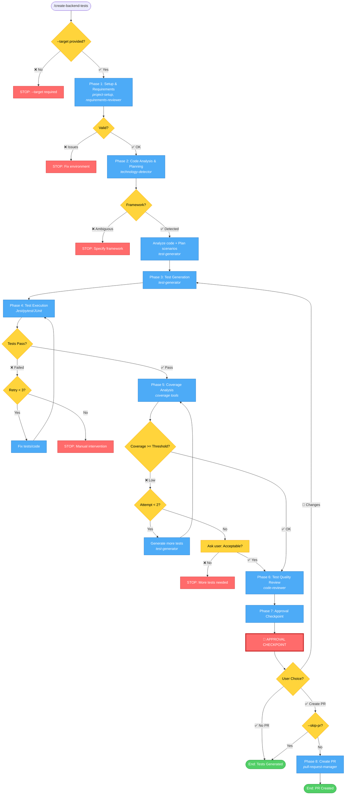

# Backend Test Generation Workflow - Simplified

## Command: `/create-backend-tests --target <path> [--type <type>] [--coverage-threshold <num>] [--skip-pr]`



## Phases

1. **Setup & Requirements** → Validate environment, identify targets, check framework
   - **Agents**: `shared-agents::project-setup`, `shared-agents::requirements-reviewer`

2. **Code Analysis & Planning** → Detect framework, analyze code, plan test scenarios
   - **Agents**: `shared-agents::technology-detector`, `test-orchestration::test-generator`

3. **Test Generation** → Generate tests with proper mocking and AAA pattern
   - **Agents**: `test-orchestration::test-generator`

4. **Test Execution** → Run tests, retry up to 3 times on failure
   - **Tools**: Test framework (Jest, pytest, JUnit) via bash commands

5. **Coverage Analysis** → Check coverage, generate more tests if below threshold
   - **Tools**: Coverage tools (istanbul, coverage.py, JaCoCo) via bash commands

6. **Test Quality Review** → Review test code quality and maintainability
   - **Agents**: `shared-agents::code-reviewer`

7. **Approval Checkpoint** → User reviews and decides next action
   - **Process**: User decision point (no agent)

8. **PR Creation** (conditional) → Create pull request with test summary
   - **Agents**: `git-actions::pull-request-manager` (via `/create-pull-request` command)

## Possible Outcomes

### ❌ STOP Conditions
- **Phase 1**: --target not provided, environment issues
- **Phase 2**: Framework ambiguous
- **Phase 4**: Tests fail after 3 retries
- **Phase 5**: Coverage low and user declines

### 🛑 Approval Checkpoint (After Phase 6)
User decides:
1. **Request Changes** → Return to Phase 3 with feedback
2. **Approve without PR** → End workflow
3. **Approve and Create PR** → Continue to Phase 8 (if --skip-pr not set)

### ✅ Success Outcomes
- **End without PR**: Tests generated, passing, coverage met, quality reviewed
- **End with PR**: Tests generated, passing, coverage met, quality reviewed, PR created

## Flags

- `--target` (required): File or directory to test
- `--type` (optional): Test type (unit/integration/e2e/all) - default: unit
- `--coverage-threshold` (optional): Minimum coverage % - default: 80
- `--skip-pr` (optional): Skip PR creation

## Test Types

- **unit**: Unit tests only (fastest, most common) - DEFAULT
- **integration**: Integration tests (DB, APIs)
- **e2e**: End-to-end tests (full workflows)
- **all**: All test types (comprehensive)

## Supported Frameworks

- **Node.js**: Jest, Vitest (Express, NestJS)
- **Python**: pytest (Django, FastAPI)
- **Java**: JUnit (Spring Boot)

## Example Usage

```bash
# Basic usage
/create-backend-tests --target src/services/user.service.ts

# With custom coverage threshold
/create-backend-tests --target src/services/ --coverage-threshold 90

# Integration tests without PR
/create-backend-tests --skip-pr --target src/api/ --type integration

# All test types
/create-backend-tests --target src/services/payment.service.ts --type all
```

## Success Criteria

- All tests passing
- Coverage meets/exceeds threshold (default: 80%)
- Tests follow AAA pattern
- Proper mocking of dependencies
- Independent tests (no shared state)
- Framework-specific best practices
