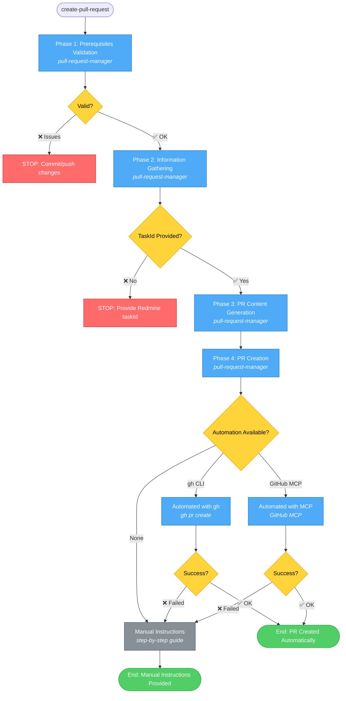

# Create Pull Request Workflow - Simplified

## Command: `/create-pull-request` or via other workflows

## Phases

1. **Prerequisites Validation** → Check git status, branch pushed, branch name
   - **Agents**: `git-actions::pull-request-manager`

2. **Information Gathering** → Collect taskId, feature summary, changes, security results
   - **Agents**: `git-actions::pull-request-manager`

3. **PR Content Generation** → Generate PR title, description, commit message
   - **Agents**: `git-actions::pull-request-manager`

4. **PR Creation** → Automated (gh CLI/MCP) or manual instructions
   - **Agents**: `git-actions::pull-request-manager`
   - **Methods**: GitHub CLI (`gh`), GitHub MCP, or manual instructions

## Possible Outcomes

### ❌ STOP Conditions
- **Phase 1**: Uncommitted changes, branch not pushed
- **Phase 2**: TaskId not provided or invalid format

### ✅ Success Outcomes

#### Automated (Preferred)
- **gh CLI**: PR created automatically with gh pr create
- **GitHub MCP**: PR created programmatically via MCP
- **Fallback**: Falls back to manual if automation fails

#### Manual (Fallback)
- Complete step-by-step instructions
- All PR content formatted for copy-paste
- GitHub repository URL provided
- Reminder about post-PR actions

## PR Description Includes

- **Redmine Task**: Link to task
- **Description**: Feature summary
- **Changes Made**: Key changes list
- **Security**: Audit status and summary
- **Testing**: Approach and coverage
- **Screenshots/Demo**: If applicable
- **Breaking Changes**: If any
- **Checklist**: Completion status

## Post-Creation Actions

- Add reviewers
- Update Redmine task status to 'In Review'
- Notify team
