# Frontend Feature Workflow - Simplified

## Command: `/frontend-feature [--skip-pr]`

```mermaid
flowchart TD
    Start([/frontend-feature]) --> Phase1["Phase 1: Setup & Requirements<br/><i>project-setup, requirements-reviewer</i>"]

    Phase1 --> Valid1{Valid?}
    Valid1 -->|❌ Issues| Stop1[STOP: Fix environment/requirements]
    Valid1 -->|✅ OK| Phase2["Phase 2: Development<br/><i>technology-detector</i>"]

    Phase2 --> Detect{Framework?}
    Detect -->|Angular| Dev1["Angular Implementation<br/><i>angular-developer</i>"]
    Detect -->|React| Dev2["React Implementation<br/><i>react-developer</i>"]
    Detect -->|Mobile| Dev3["Mobile Implementation<br/><i>mobile-developer</i>"]
    Detect -->|❌ Ambiguous| Stop2[STOP: Specify framework]

    Dev1 --> Phase2_5
    Dev2 --> Phase2_5
    Dev3 --> Phase2_5["Phase 2.5: Code Quality Review<br/><i>code-reviewer</i>"]

    Phase2_5 --> Phase3["Phase 3: Security Audit<br/><i>security-auditor</i>"]

    Phase3 --> Approval[🛑 APPROVAL CHECKPOINT]

    Approval --> Choice{User Choice?}
    Choice -->|🔄 Changes| Phase2
    Choice -->|✅ No PR| End1([End: Feature Complete])
    Choice -->|✅ Create PR| CheckFlag{--skip-pr?}

    CheckFlag -->|Yes| End1
    CheckFlag -->|No| Phase4["Phase 4: Create PR<br/><i>pull-request-manager</i>"]

    Phase4 --> End2([End: PR Created])

    classDef stopStyle fill:#ff6b6b,stroke:#c92a2a,color:#fff
    classDef successStyle fill:#51cf66,stroke:#2f9e44,color:#fff
    classDef phaseStyle fill:#4dabf7,stroke:#1971c2,color:#fff
    classDef decisionStyle fill:#ffd43b,stroke:#f59f00,color:#000
    classDef checkpointStyle fill:#ff6b6b,stroke:#c92a2a,color:#fff,stroke-width:4px

    class Stop1,Stop2 stopStyle
    class End1,End2 successStyle
    class Phase1,Phase2,Phase2_5,Phase3,Phase4,Dev1,Dev2,Dev3 phaseStyle
    class Valid1,Detect,Choice,CheckFlag decisionStyle
    class Approval checkpointStyle
```

## Phases

1. **Setup & Requirements** → Environment validation + Requirements review
   - **Agents**: `shared-agents::project-setup`, `shared-agents::requirements-reviewer`

2. **Development** → Framework detection + Feature implementation
   - **Agents**: `shared-agents::technology-detector`
   - Then routes to: `frontend-mobile-development::angular-developer` OR `frontend-mobile-development::react-developer` OR `frontend-mobile-development::mobile-developer`

3. **Code Quality Review** → Code review with findings
   - **Agents**: `shared-agents::code-reviewer`

4. **Security Audit** → OWASP Top 10 security check
   - **Agents**: `security-compliance::security-auditor`

5. **PR Creation** (conditional) → Create pull request
   - **Agents**: `git-actions::pull-request-manager` (via `/create-pull-request` command)

## Possible Outcomes

### ❌ STOP Conditions
- **Phase 1**: Environment issues, unclear requirements
- **Phase 2**: Ambiguous framework

### 🛑 Approval Checkpoint (After Phase 3)
User decides:
1. **Request Changes** → Return to Phase 2
2. **Approve without PR** → End workflow
3. **Approve and Create PR** → Continue to Phase 4 (if --skip-pr not set)

### ✅ Success Outcomes
- **End without PR**: Feature implemented, quality + security reviewed
- **End with PR**: Feature implemented, quality + security reviewed, PR created

## Flags

- `--skip-pr`: Skip Phase 4 entirely
