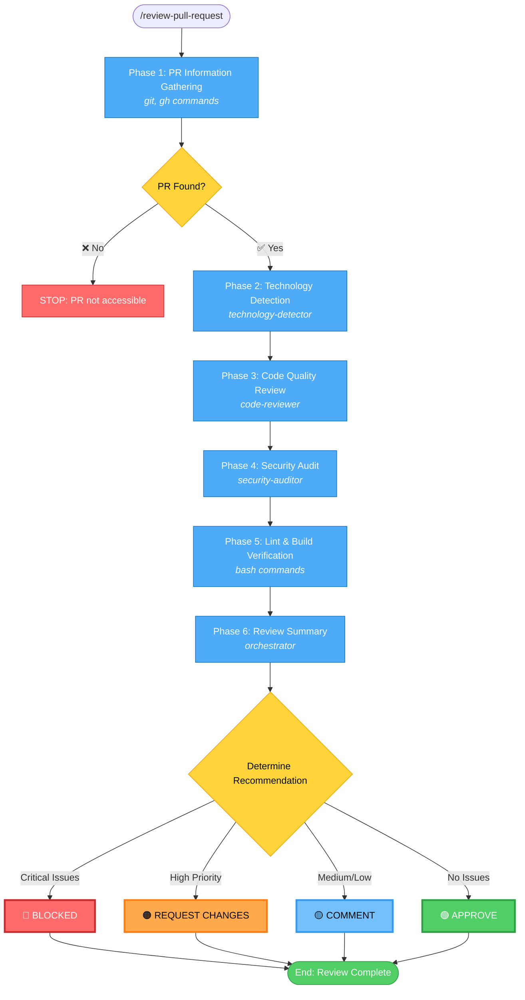

# Pull Request Review Workflow - Simplified

## Command: `/review-pull-request <PR_NUMBER>`

## Phases

1. **PR Information Gathering** → Fetch PR details, changes, commits
   - **Tools**: `git`, `gh` commands (no agent)

2. **Technology Detection** → Identify languages, frameworks, tools
   - **Agents**: `shared-agents::technology-detector`

3. **Code Quality Review** → Analyze code with tech-specific lens
   - **Agents**: `shared-agents::code-reviewer` (invoked as pr-reviewer)

4. **Security Audit** → OWASP Top 10 vulnerability scan
   - **Agents**: `security-compliance::security-auditor`

5. **Lint & Build Verification** → Run linting, build, type checks
   - **Tools**: Bash commands (no agent)

6. **Review Summary** → Consolidate findings and determine recommendation
   - **Process**: Orchestrator consolidates all findings (no agent)

## Possible Outcomes

### ❌ STOP Conditions
- **Phase 1**: PR not found or inaccessible

### Review Recommendations

#### 🔴 BLOCKED
- **Triggers**: Critical security vulnerabilities OR build failures
- **Action**: Do not merge until resolved

#### 🟠 REQUEST CHANGES
- **Triggers**: High priority code quality issues OR security warnings
- **Action**: Address issues before merge

#### 🟡 COMMENT
- **Triggers**: Medium/low priority suggestions OR performance optimizations
- **Action**: Consider addressing, but can merge

#### 🟢 APPROVE
- **Triggers**: No significant issues found
- **Action**: Ready to merge

## Review Report Includes

- **Summary**: Issue counts by severity (Critical, High, Medium, Low, Nitpick)
- **Technology Stack**: Detected frameworks and tools
- **Code Quality Findings**: Categorized by severity with file:line references
- **Security Findings**: OWASP vulnerabilities with remediation
- **Build Results**: Lint errors, build failures, type errors
- **Positive Highlights**: Good patterns found
- **Next Steps**: Actionable recommendations
